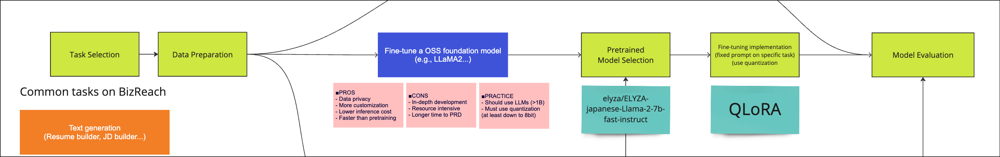

Five years ago, I embarked on my journey at [Visional Inc.](https://www.visional.inc/ja/index.html), as a fresh graduate eager to contribute to the AI and Machine Learning landscape in Tokyo, Japan. Three years ago, I penned my [2-Year milestone recap](/blog/2021-visional) that I had documented earlier and I believe that I have grown exponentially since then. At the time, I was excited about the projects I had worked on, the growth I had experienced, and the challenges I had overcome. 

Now, as I stand at the cusp of my fifth anniversary, it's a good time to reflect on the evolution of my role, my achievements, and the exciting challenges that have shaped me into the engineer I am today.

```
```
## Contents

- <a href="#revisiting">Revisiting My Foundations</a>
  1. <a href="#manager">A New Manager: Better communication</a>
  2. <a href="#okrs">OKRs: Linking Personal and Professional Growth</a>
  3. <a href="#learning">Continuous "Deep" Learning</a>
  4. <a href="#tools">Tools for Enhanced Productivity</a>
- <a href="#projects">My Projects</a>
  - <a href="#p1">Resume Generation (Multiple Versions)</a>
  - <a href="#p2">AI MLOps: Feature Store PoC</a>
  - <a href="#p3">Resume LLM Fine-tuning (R&D Project)</a>
  - <a href="#p4">Financial Document OCR System (Improvements)</a>
- <a href="#company">About Visional</a>
- <a href="#conclusion">The Road Ahead</a>

```
```


<h2 id="revisiting">Revisiting My Foundations</h2>

When I was writing my [2-Year recap blog](/blog/2021-visional), I was still finding my footing in the world of Machine Learning, juggling between different roles as a Data Scientist, ML Engineer, and Research Scientist. I was focused on delivering value through the projects I worked on, such as the Financial Document OCR System and research projects like Employee Slack Analytics or Japanese Handwritten OCR research. These projects were critical in building my technical foundation, allowing me to dive deep into the practical aspects of ML workflows.

As I transitioned into the next phase of my career, I began to realize the importance of not just being an effective contributor but also taking on leadership roles within projects, especially in shaping their direction and execution. This leads to what I believe were **key developments in the last three years**.

<h3 id="manager">1. A New Manager: Better communication</h3>

One of the most significant changes in my professional life was hands-down my Vietnamese team lead becoming my manager. This transition had a profound impact on how I approached my work. Being able to directly converse in English with my manager, not only about technical issues but also management-related concerns made me more comfortable in my place within the team. Communication within the team became more seamless, and I found myself more involved in the early roadmapping phases of projects.

A notable example was the <a href="#p1">Resume Generation project</a>, a super impactful project where I was able to contribute right from the brainstorming stage. This involvement not only allowed me to secure projects more easily but also gave me the confidence to push for innovative solutions to both technical and management related issues. I am truly grateful for having him as my manager for the past 3 years. 

<h3 id="okrs">2. OKRs: Linking Personal and Professional Growth</h3>

Another shift in my professional growth came from my adoption of personal OKRs (Objectives and Key Results), a practice inspired by Google's approach, which I learned from reading the book [Measure What Matters by John Doerr](https://www.google.co.jp/books/edition/_/VEtTDwAAQBAJ). I believe that I had initially struggled with the company’s MBO (Management by Objectives) system, not knowing how they would link back to the broader company objectives OR my own career goals. OKRs are designed to be transparent and cascaded through organization levels. 

Adopting such a practice for my personal goals taught me how I could link my work with my career goals, focusing on *outcomes rather than output*. This personal system kept me on track, ensuring that my work was always purposeful and aligned with both my professional growth and the company's vision.

<h3 id="learning">3. Continuous "Deep" Learning</h3>

Reading [Designing Machine Learning Systems by Chip Huyen](https://www.oreilly.com/library/view/designing-machine-learning/9781098107956/) was a game-changer for me. The book provided me with a comprehensive understanding of ML systems, evolving my notion of machine learning beyond just developing an *End-to-End Pipeline*, to a holistic *Machine Learning Life Cycle* - from data collection to deployment. Learning best practices in designing scalable and reliable ML systems is crucial for moving from experiments/internal projects to production-grade applications. 

The book particularly emphasized the significance of MLOps — a field that was coincidentally gaining momentum within our team thanks to a new colleague who moved to our company from AWS as an MLOps Architect. I have learned a lot from our conversations on Teal Organizations, Team Topologies, frameworks for Logical Thinking, and in general MLOps. Armed with this new knowledge, we proposed a <a href="#p2">re-architecture of our AI MLOps</a>, focusing on scaling our infrastructure and improving the reliability of our models in production. This initiative was a key milestone in my journey, marking the transition from being a contributor to a thought leader in my team.

<h3 id="tools">4. Tools for Enhanced Productivity</h3>

When a person with ADHD who has always been an academic achiever finds themselves unable to change jobs, be it due to fear of change, high standards or even emotional attachment, they begin to devise personalized workflows to keep up with the increasing complexity of projects. 

**Google Meets’ closed captioning** and the **Google Translate browser extension** allowed me to better understand in-person and virtual meetings, ensuring that I remained an active participant in all discussions, regardless of language barriers. The move from Confluence to **Scrapbox** as a documentation tool in our company, which is coupled with **DeepL** for translations, helped me bridge the language gap and contribute more effectively in Japanese.

Outside the language barrier, **Miro** became indispensable for system architecture designs and big-picture mind maps, helping me and my team visualize and communicate complex ideas effortlessly. Tools like **ChatGPT/Copilot** for code improvement, debugging, and documentation significantly boosted my productivity.

```
```
<h2 id="projects">My Projects</h2>
The past three years have been transformative, owing to key projects which not only tested my technical skills but also pushed me to grow as a leader and innovator in the ML space. I found myself going the extra mile, partly due to the demands of the project and partly due to the passion and satisfaction I discovered while working on them.


<h3 id="p1">Resume Generation (Multiple Versions)</h3>
The Resume Generation project has been an ongoing effort, with several key milestones achieved over the last three years - even prior to the advent of ChatGPT. I can summarize the changes brought by each version, and how they were built upon the previous version.

##### *Version 0: Keyword Suggestion*
The first and foremost AI assistance our platform could provide candidates in the registration process was suggesting them relevant keywords to enhance their profiles. This version used algorithms like tfidf and k-means clustering to recommend keywords which candidates could simply incorporate into their project descriptions, thereby increasing their scout rates with recruiters. I joined the resume generation project with this version already in production.

##### *Version 1: Keyword Recommendation -> Sentence Recommendation*
Building on the basics, we moved towards a more sophisticated approach: recommending sentences to candidates while they wrote their project descriptions. This version introduced a two-step pipeline, each step trying to reduce the distance between inputs and outputs in an embedding space. I focussed mainly on the first component. 
1. **Keyword Recommendation**
Input: Resume text and categorical features. Output: Relevant keywords.
   - Resume features were vectorized and concatenated to form a resume vector. Topic modeling using LDA was used to create an embedding model for resume-keyword similarity
2. **Sentence Recommendation**
Input: User selected keywords Output: Relevant next sentences.
   - A BERT Semantic Textual Similarity (STS) model was used to find possible next sentences similar to keywords selected in the previous step

##### *Version 2: Keyword Recommendation -> Text Generation*
ChatGPT was released to the world in the beginning of Dec 2022. Within days, our senior engineers had built a prototype with the `text-davinci-003` API, which led to rapid developments post-New year. A large project team was formed, including frontend, backend, ML, QA, legal, etc., and I found myself sitting beside my manager on the largest Japanese round table in my life, and between listening hard to navigate fast-paced discussions and vaguely looking at my manager, I was trying to fit together context like pieces of a jigsaw. I made through it - somehow, and was set to release the first version of the new ML system within 2 months, the backbone to what became one of the most intense, yet rewarding, phases of my career so far.

Those two months of development felt like a throwback to my university days, filled with late hours and deep focus. But that's a story for another time—let's stick to the technical milestones. Buy me a coffee to hear more, I guess!


1. **Keyword Recommendation: Improvements**
The embedding model for resume-keyword similarity was iteratively improved as follows:
   - Resume features were transformed into BERT input strings. Semantic Textual Similarity was used to train resume-keyword similarities
   - Reranking was introduced according to keyword selection rate and search popularity 
2. **Text Generation: ML System Design**
We transitioned to a microservices-based architecture, enabling independent handling of different components in the resume generation pipeline. Key features included:
   - Message-forwarding and queuing via AWS SQS and DynamoDB 
   - Multithreading capabilities, processing up to 60 generation requests per minute, within OpenAI’s rate limits
   - A robust internal mapping system to manage OpenAI's success/error responses
   - Moderation layers to act as guardrails to reinforce the `harmless` in the [3Hs for LLMs](https://arxiv.org/abs/2112.00861)

<p align="center">
  
</p>

The system required high cross-team collaboration with product backend, frontend and QA teams. I took the initiative to create the first Datadog dashboard for the AI ​​team, making it easy to share weekly insights, respond to incidents, improving the flow of communication on the AI side.

<p align="center">
  
</p>


The business impact? A [40% improvement in our scout-reception KPIs](https://www.bizreach.co.jp/pressroom/pressrelease/2023/070601.html)! 

Oh, and the team received the Best Project Team Award at the BizReach Awards 2023. Look at the size of the team! The memories of that project are still fresh, and the award ceremony—a reminder of how collective effort and innovation can lead to extraordinary results.

<p align="center">
  
</p>

Almost a year has passed since then, and with the system architecture in place, the focus shifted to optimizing performance:
- Explored various ML models to improve keyword recommendation metrics for better user experience
- Improved prompt templates across different job categories, guided by [prompt engineering best practices](https://arxiv.org/html/2312.16171v1)
- Improved incident response, reducing time-to-detect (TTD) and time-to-mitigate (TTM) by adding more alerts and implementing redundancy measures, such as provider/region switching
- Redesigned the architecture to support multi-API integration, ensuring backward compatibility while introducing new features and enhanced prompts.

The Resume Generation project has been one of the most impactful projects I've worked on, significantly contributing to the company’s core offerings and demonstrating my ability to lead and deliver in complex, multi-phase projects.


<h3 id="p2">AI MLOps: Feature Store PoC</h3>

As mentioned above I had started reading [Designing Machine Learning Systems by Chip Huyen](https://www.oreilly.com/library/view/designing-machine-learning/9781098107956/) in the start of 2024. Learning about best practices in a holistic *Machine Learning Life Cycle* inspired me to connect more with our MLOps team. In our discussions we identified a [technical debt](https://research.google/pubs/machine-learning-the-high-interest-credit-card-of-technical-debt/) in the form of overlapping data pipelines within a significant portion of our around 30 batch pipelines in production. 

As a young ML Engineer, I remember spending 2 weeks building a search ML pipeline from scratch that I later found out could have just been modified from another team's project that used the same data. I can say, I have always had a passion for automation and standardization.  This need to standardize and centralize features across multiple pipelines and projects resulted a proposal for the re-architecture of our AI MLOps systems, centered around developing AI Group's first Feature Store as a proof-of-concept (PoC). 

Although it is still early in my MLOps journey, I strongly believe that Google has set the standard in this space, and their documentation is a gold mine of learning. They summarize [a Golden Path to MLOps](https://cloud.google.com/architecture/mlops-continuous-delivery-and-automation-pipelines-in-machine-learning), which became my go-to resource for understanding how to incrementally build an organization's MLOps capabilities across CI/CD/CT pipelines. It shows how higher levels of automation could **accelerate** the ML lifecycle. Higher the level, higher the **velocity** of deploying new models given new data/implementations. 

It is worth noting that each organization takes a different path, but as mentioned in [Vertical First Horizontal Second](https://sistel.medium.com/the-mlops-engineer-vertical-first-horizontal-second-306fa7b7a80b), achieving early vertical breakthroughs is critical. This approach involves "agile" deployment of vertical prototypes early in the development process to detect risks, iterate quickly, and align closer with production settings and stakeholders. However, at some point we do need to increase an ML team's breadth and move to horizontal splitting.

While our journey towards MLOps maturity shares commonalities with Google's levels, it is not a direct testament to Google's MLOps level definitions.  Instead, it reflects **our unique path**, tailored to our specific challenges, infrastructure, and business needs. By understanding where we stand and the steps we've taken, we can better appreciate our progress and identify areas for further improvement. Here was my take on our starting point and destination:

<p align="center">
  
</p>

Once our MLOps vision reached a practical stage, we attended a 2-day **Google MLOps Mini TAP (Tech Acceleration Program)** at the Google Tokyo Office to refine our MLOps direction using Google Cloud’s solutions. We decided to implement the first PoC using [Vertex AI](https://cloud.google.com/vertex-ai/docs/featurestore). 

For the Feature Store PoC, I led the design and implementation of the feature store schema, focusing on decoupling the data and model pipelines for an existing low-impact score prediction project. This project had feature overlaps with others, making it the perfect candidate for standardization. The process required a lot of self-study, but it ultimately equipped me with a solid understanding of the core components:

1. **Data Pipeline**: Apache Beam, Google Dataflow (flex-templates)
2. **Model Monitoring**: Vertex AI Model Monitoring 
3. **Online Feature Serving**: Vertex AI Feature Store

Parallely, my colleague focussed on **Model Training**, **Model Evaluation** and **Model registration**. FWe later integrated everything into a coherent workflow using **Kubeflow Pipelines (kfp)**.

Looking back, this PoC was a major step forward for us. It wasn’t just about implementing new technology—it was about laying the groundwork for future scalability and improving the overall velocity of our ML projects. There's a lot to do next term!

<h3 id="p3">Resume LLM Fine-tuning (R&D Project)</h3>

In an effort to stay at the cutting edge of the recent boom in AI and LLMs, I took on the challenge for an R&D project focused on fine-tuning a Large Language Model (LLM) for resume generation, building upon my work on the Resume Generation project. 

This project was particularly challenging as it involved working with vast amounts of unstructured text data and adapting a pre-trained LLM to our specific domain. The main aim was to explore the feasibility of developing an in-house LLM to reduce the dependence on external models like ChatGPT. A secondary outcome was to establish a baseline PoC for LLM fine-tuning within our AI Group.


<p align="center">
  
</p>

As the sole contributor to this R&D task, I approached the project with a flexible proposal and roadmap, which led to the following structured approach:
1. Self-learning and Methodology review
   - Conducted an in-depth review of [LLM fine-tuning methods](https://qiita.com/mshinoda88/items/fc562ec6a84f45e89e70#llm%E3%81%AEfine-tuning%E6%89%8B%E6%B3%95%E3%81%BE%E3%81%A8%E3%82%81) such as LoRA and PEFT
   - Surveyed various pre-trained and fine-tuned models in the [HuggingFace documentation](https://huggingface.co/learn/nlp-course/chapter3/1?fw=pt)
   - Completed the [Generative AI with Large Language Models](https://www.linkedin.com/feed/update/urn:li:activity:7160184133703372800/) course offered by DeepLearning.AI and Amazon Web Services to enhance my understanding of these techniques
2. Data Engineering and training data curation
   - Data sampling ensuring high alignment with business KPIs along with diversity and representativeness
   - Extracting features from candidate resumes using NLP techniques
   - Structured these features into prompts with the `Alpaca format` for instruction fine-tuning (supervised) 
3. Base model selection: [elyza/ELYZA-Japanese-Llama-2-7b-fast-instruct](https://huggingface.co/elyza/ELYZA-japanese-Llama-2-7b-fast-instruct)
   - open-source 7B parameter model with Japanese language capabilities
   - fine-tuned on Meta's [Llama2](https://llama.meta.com/llama2/) Large Language Model
4. Fine-tuning Experiments
   - QLoRA (using bitsandbytes and PEFT) to optimize compute budget
   - Tuning batch sizes to optimize memory and training time
   - Filtering prompt lengths to reduce memory usage (irregular padding) and increase batch sizes
5. LLMOps
   - Running large parametric TrainingJobs from small SageMaker notebook instances
   - Logging results and metrics (eg. ROUGE score) to S3 for quality feedback from domain experts, crucial in refining the model and improving output quality


In the end, as expected, there was much room for improvement. It requires a lot more effort to achieve expected metrics and quality to beat a proprietary external LLM. Enhancing data size and quality, tuning model parameters, implementing iterative evaluation with human feedback (RLHF) were some of the ways in which I could have refined performance. The project sucessfully laid the groundwork for future LLM fine-tuning efforts within our AI Group, showcasing the potential for developing specialized in-house models tailored to our unique needs.


<h3 id="p4">Financial Document OCR System Improvements</h3>

Building on the success of the [initial Financial Document OCR system](/blog/2021-visional#p1), I led 2 major improvement phases that further enhanced the system’s accuracy and usability.

Improvement 1: 
The first phase focused on improving the text recognition accuracy, particularly for documents with poor scan quality or complex layouts. I incorporated advanced image preprocessing techniques such as noise reduction, skew correction, and adaptive thresholding. The qualitative evaluation score passed for 90% of the test files as a result, increasing from around 85% last term. As an extra, the output format was changed from XLS to XLSX for better compatibility.

Improvement 2: 
The second phase aimed at expanding the support for 4 new types of documents. I designed image processing algorithms able to deal with tables with defined cell boundaries as well as processing wrapped text in such cells. The format detection logic was updated to support both old and new algorithms.

While I am aware that new and faster methods using multi-modal LLMs are now available, but at that time, these improvements had not only enhanced the system's performance but also reduced the manual effort required in processing financial documents, leading to substantial time savings and increased productivity for the team. A benchmarking by the Succeed team proved the internal tool to be better than [Line Works OCR](https://line-works.com/ai-product/ocr/) tool in terms of data privacy, ease of use and specialized usecase. 

<p align="center">
  
</p>


```
```

<h2 id="company">About Visional</h2>

<p align="center">
  
</p>

Established in April 2009, BizReach has been operating a variety of Internet services that support the future of work in Japan with a mission that roughly translates into "creating a society where everyone can believe in their own potential". The company, headquartered in (Shibuya) Tokyo, has regional offices in Osaka, Nagoya, Fukuoka, Shizuoka, and Hiroshima.

Visional was born in February 2020, when Bizreach Inc. shifted to a group management structure. The company has continued its significant role in Japan’s HR Tech and SaaS sectors that promote digital transformation (DX) of industry and support the improvement of productivity in Japan. 

Within the last 3 years, Visional Inc. was also listed on the Tokyo Stock Exchange. Initially listed on the TSE's Mothers segment on April 22, 2021, Visional successfully transitioned from the Growth Market segment to the Prime Market segment on December 14, 2023. The company has demonstrated strong financial performance. As of late July 2024, Visional was trading at a price around 9,370 JPY with a market cap of approximately 367.44 billion JPY. Their P/E ratio stands around 24.66 and a significant profit growth of 53.2% YoY in FY2024 Q3​.

Visional has strengthened its HR Tech segment, particularly through platforms like HRMOS, which now includes talent management, recruiting, attendance management, and payroll services. These platforms are central to helping companies utilize human resources based on data-driven insights. The incubation segment has also seen significant growth, focusing on developing new businesses in areas with high market potential, particularly in logistics and business-to-business (B2B) services​. 

The group broadly has a heirarchical structure with the following products and services:

- [Visional Corporation](https://www.visional.inc/ja/index.html), the holding company,
supports the group management
- [Bizreach Corporation](https://www.bizreach.co.jp/), responsible for the management of
the original HR Tech and SaaS businesses
  - [Bizreach](https://www.bizreach.jp/), a professional HR platform that connects companies with available talent
  - [HRMOS Talent Management](https://hrmos.co/hr), an employee management platform
  - [HRMOS Recruitment](https://hrmos.co/ats), an recruitment management system
  - [HRMOS Attendance](https://hrmos.co/kintai), an attendance management system
  - [HRMOS Expenses](https://www.ezsoft.co.jp/ekeihi/), an expense settlement system
  - [HRMOS Payroll](https://hrmos.co/payroll), a payroll management system
  - [Bizreach Campus](https://br-campus.jp/), an alumni network service for career consultation
- [Visional Incubation Corporation](https://www.visional.inc/ja/visional-incubation.html),
responsible for new business development and acquisitions
  - [M&A Succeed](https://ma-succeed.jp/), an M&A platform for business succession
  - [Yamory](https://yamory.io/), security vulnerability management cloud for IT systems
  - [Trabox](https://www.trabox.ne.jp/), a platform focused on digital transformation in the logistics industry
  - [Assured](https://assured.jp/ja/), a cloud security risk assessment service
  - [StanBy](https://jp.stanby.com/), a job-search engine jointly owned with Yahoo Japan

Each of the products have their own specific engineering teams that follow custom Agile software development life cycles (SDLCs) they are comfortable with. 

The **AI Team** is a team of around 20 ML/AI engineers that collaborate with one or more of the above mentioned products to understand their business requirements, and leverage data to deploy AI features in production environments to drive business solutions.

```
```

<h2 id="conclusion">The Road Ahead</h2>

The last three years have not just been about professional growth; they have also been about personal development. Adopting OKRs, improving my communication skills in a multilingual environment, and taking ownership of more complex projects have all contributed to a more holistic growth trajectory. I’ve learned to balance my technical expertise with strategic thinking, ensuring that I can contribute effectively both as an engineer and as a leader.

As I look forward to the next phase of my career, I am excited about the possibilities that lie ahead. After a quarter of my life, I am well aware that I shall always be a Jack-of-all-Trades. Whether it’s further deepening my expertise in MLOps, taking on more leadership roles, or exploring new domains within LLM applications, I am confident that the foundation I’ve built over these five years will serve me well. 

Also, after all these years, I am happy that I can say "頑張りましたね！", instead of my usual "eigo tabemasen.." lol.

```
```

This blog serves as a continuation of my reflection from three years ago. If you're interested in understanding how it all began, feel free to check out [A Look Back at My First Full-Time Job](/blog/2021-visional).
