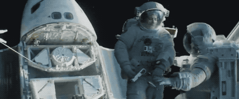
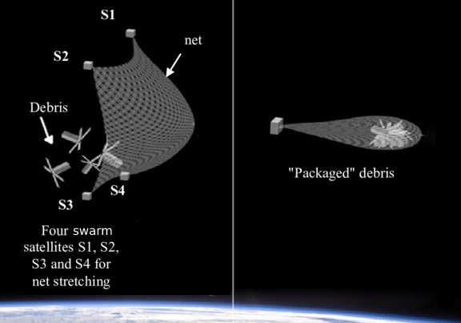
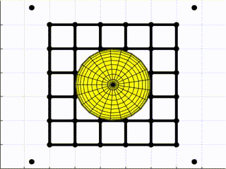
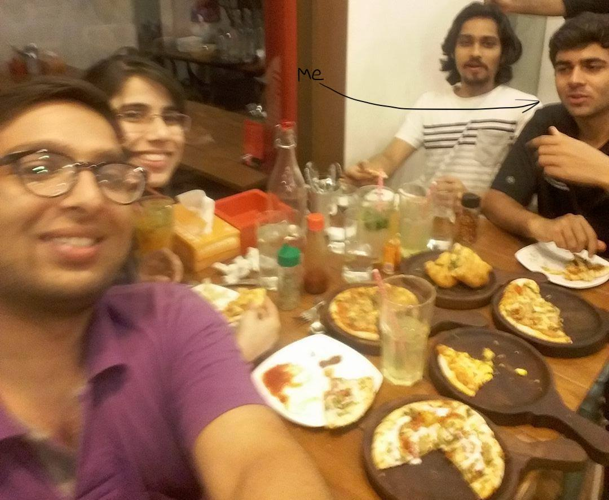

I spent the summer of 2017 as a research intern at the [ISRO Satellite Centre, Bangalore](https://www.ursc.gov.in/).

At the start of my third-year at IIT Kharagpur, I would not have guessed that I
would get to work for [my country's national space agency](https://www.isro.gov.in/)
and be able to further ongoing theoretical research on ways to tackle the Kessler syndrome.

In this internship, I designed mathematical models and simulations for physical objects interacting in space.

```
Contents

- How I got selected
  - Resume
  - Application Process
  - Interview Call

- The Project
  - Objectives
  - Motivation
  - Implementation
  - Result

- My Experience
```

## How I got selected

### Resume

Well, other than being enrolled in an Aerospace Engineering degree at one of the most
prominent institutes of the country, the strongest point on my resume was a
successful 3-month internship at [Team Indus](https://www.teamindus.in/) in the summer of 2016. Team Indus is a private for-profit aerospace company that was all geared up at
winning the [Google Lunar X Prize competition](https://www.xprize.org/prizes/google-lunar/competing-teams). I had designed some mathematical models and simulations for thruster
misalignment estimation during various burn phases, mainly in MATLAB.

### Application Process

The application process was tricky. I could not find an "open positions" page
online. And if you have ever been to the ISRO website, it's really hard to find
what you're looking for. No, my best friend here, was networking.

I had heard about the [Indian Institute of Space Science and Technology](https://www.iist.ac.in/) having direct ties with ISRO, and that students usually go for internships at
various labs across the entire space agency. Through a bit of googling, I found a
list of students who had interned at the ISRO Satellite Centre the previous summer,
and through a bit of facebooking, I found one student with a close mutual friend.
I soon scheduled a call with her, and she turned out be a really interesting person.
We talked about her project which was based on robotics, as well as her university life.
She set me up for a call with her mentor, who was also a graduate from her university.

### Interview Call

My call with my mentor, [Mr Aditya R.](https://twitter.com/arallapalli), basically involved
a CV runthrough, an extensive discussion about my work at Team Indus, and a free-talk
about my interests and projects at IIT Kharagpur. To my relief, he said he was looking
for interns and my resume matched his requirements. More luckily, I got to choose between
2 projects to work on!

```
```

## The Project

### Objectives

The goal of the project was to simulate active space debris removal using tether-net
connected to satellites in formation. There were 3 main concepts involved:

- Spacecraft formation flying. This topic is well explored and enough literature was
available. It involved relative position control combined with orbital mechanics.

- Tether net modelling. The behaviour of the net had to be described as a spatially
distributed mechanical system.

- Contact dynamics. The collective behaviour of the net and the satellites in formation
during and after debris contact phases.

### Motivation

Among many things, space is also the most dangerous junkyard Earth has created.
If you have seen the 2013 film Gravity, the accident that caused the astronauts
to break off from the ship was due to the debris in space.



It is estimated that there are 600,000 debris fragments ranging from 1~10 cm,
and on average one satellite is destroyed by collision with space junk each year.
If satellites are not disposed of properly, the parts could become high-speed bullets
leading to a chain reaction of collisions, a theoretical scenario popularly known
as the [Kessler Syndrome](https://en.wikipedia.org/wiki/Kessler_syndrome).
Apart from dramatic accidents, such a scenario could lead to serious consequences
including unusable orbits or communication blackouts.

A number of cleanup efforts have been explored/proposed in recent years - robotic
grappling arms, harpoons, deploying nets, electrodynamic tethers, ground-based lasers, etc.

This project combined swarm satellites and tether-nets for Active Space Debris Removal.

### Implementation

Simulations for the various components were developed in MATLAB and working code was
replicated in C++ for faster experimentation. A C++ library implementation for MATLAB’s
matrix/vector manipulation was developed which reduced simulation time by 5 times
and allowed easy code porting.

#### Spacecraft formation flying



Relative orbit dynamics of two objects in close orbits, can be modelled using the
[Hill-Clohessy-Wiltshire (HCW) equations](https://en.wikipedia.org/wiki/Clohessy%E2%80%93Wiltshire_equations). These were used to model feedback linearization
based proportional-derivative (PD) controller for generating the control commands for the spacecraft, necessary to keep the spacecraft in formation to maintain the required
tether-net shape in various phases of the operation.

Continuous torque commands had to be converted to on-off commands to model actuators.
This was done using Pulse Width and Pulse Frequency modulation (PWPFM).

#### Tether net modelling



A [lumped parameter approach](https://en.wikipedia.org/wiki/Lumped-element_model#Mechanical_systems) is used to model the dynamics of the
tether-net and the tether-net to spacecraft connectivity.

This simplifies the description of the behaviour of spatially distributed
physical systems such as a tether-net, into a topology consisting of discrete
entities (nodes) that represent rigid bodies with mass and interactions between
rigid bodies as kinematic pairs (joints, springs and dampers).

### Result

The results of this research were drafted into a research paper and accepted for
[Interactive Presentation in the 69th International Astronautical Congress 2018](https://iafastro.directory/iac/archive/browse/IAC-18/A6/IP/48269/)
in Bremen, Germany. However, due to lack of sponsorship and funds, I was not able
to attend the conference.

```
```

## My Experience

As an aerospace engineering student, I was very enthusiastic about working at the
ISRO Satellite Centre, and I was very excited to fly to Bangalore as soon as my
summer vacation started.

Since I was an "unofficial" intern, I was not given any stipend, and I had to cut
my costs by staying at my uncle's place - about an hour of bus travel each day.
But also because of that, I had the benefits of working flexibly in terms of
hours and place of work.

My first week at ISAC, my mentor introduced me to the team at the Control
Dynamics and Simulation Group, who were mostly graduates from IIST. They were
really friendly, and talking to them was like talking to any senior from college.
There were 3 more interns from different universities, who had their own
stories of how they got their internships.

I usually started work at 10AM and ended work around 4PM. My mentor and I synced
up twice each week and discussed work updates every day. It motivated me to stay
on track. Since I could be flexible, I sometimes used to work from cafes near my
place instead of going to office. My mentor was super approachable, and I could
call him up in the middle of the night to discuss a sudden idea I had. I also
synced up with the group's project director, [Dr Vinod Kumar](https://www.siliconindia.com/profiles/dr-vinod-kumar-XEac3AFM.html), a few times, who told me about his long
journey at ISRO.

I enjoyed such 1on1 sessions. They helped me connect with the team better. I also
loved the two _chai breaks_, where employees used to line up for free tea/coffee
and free talk. In some of these, my mentor and the other team members used to
take us for tours of the Satellite Centre. It was unbelievable seeing the mission
control for the recently launched [GSAT-9](https://en.wikipedia.org/wiki/South_Asia_Satellite)
and [GSAT-11](https://en.wikipedia.org/wiki/GSAT-11) in development, right in front of our eyes!

However, amongst all things shiny, there were things that stood out
that I could not help feeling irritated about. Offices were similar to old Indian
government offices desperately in need of an upgrade. Some of the PCs we used to
work on were still equipped with age-old hardware like CRT monitors. My team's
office was a room divided into cubicles, which my mentor said made him feel
claustrophobic at times. I used to see more progress when I was working on my
laptop from a cafe than when I was working in a no-window office all day.

I learned a lot talking to my colleagues. The engineers/scientists shared a lot
of career insight, which had helped me gear up into changing my career in the
coming months. I discussed about some ML projects I worked on in college, and 
I learned how it was applied in projects at ISRO. Discussions that could not be
completed over _chai breaks_ were continued the next day or free pizza treats
after work!


