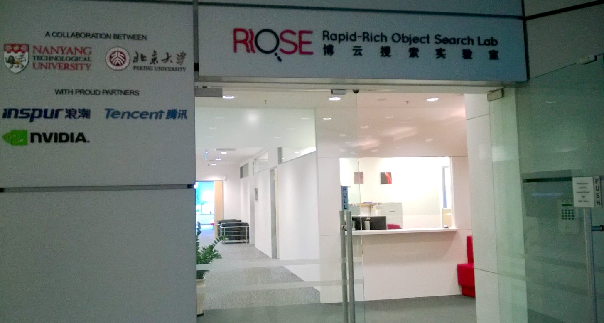
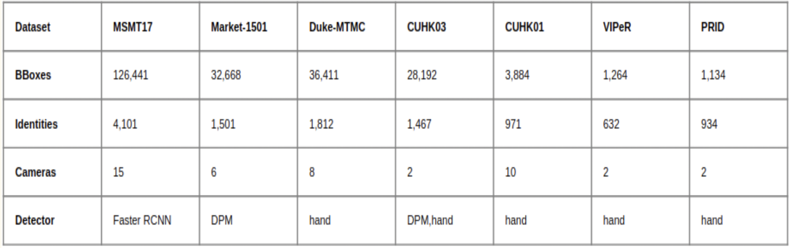
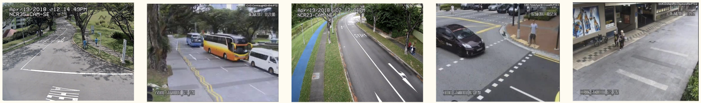
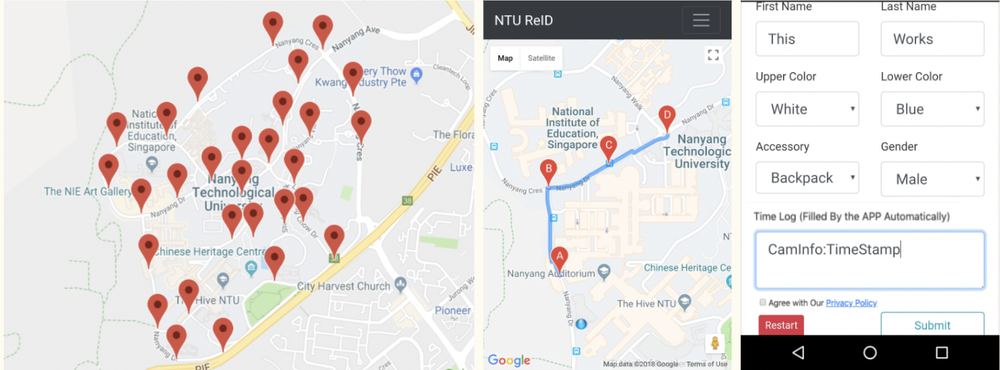
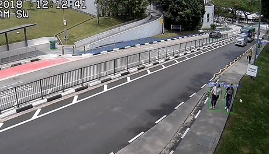
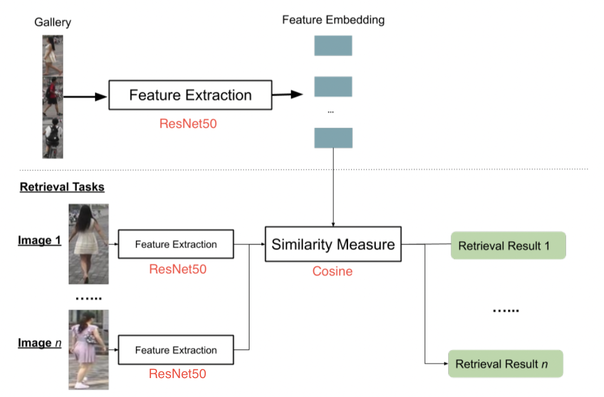
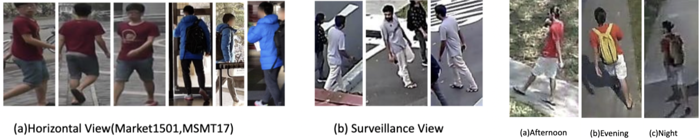

Having worked on 3 ML projects in my fourth year, I really wanted to take up the
challenge of collaborating within a distinguished research group, preferably abroad.
A foreign training or FT, as per my university lingo, was considered a prestigious
opportunity, as not only would you gain indispensable experience working in an established
institute set in an unfamiliar environment, it would also be really thrilling to
interact with people from different cultural backgrounds with similar interests
to freely exchange ideas and experiences.

Out of around 30 research labs that I applied to all over the world, I received
3 offers. I was most excited to work at the
[Rapid-Rich Object Search (ROSE) Lab](https://www.ntu.edu.sg/rose) at the
[Nanyang Technological University, Singapore](https://www.ntu.edu.sg/index),
as not only did the lab's research focus align with my interests, I would also be
able to gain work experience in [one of the top universities in Asia](https://www.topuniversities.com/university-rankings/asian-university-rankings/2018).

```
Contents

- How I got selected
  - Resume
  - Application Process
  - Interview Call

- The Lab

- The Project
  - Objectives
  - Motivation
  - Implementation
  - Result

- My Experience
```


## How I got selected

### Resume

In my fourth year, I started to diverge my career away from aerospace engineering,
to focus on my minor in Computer Science, especially in the areas of
Machine Learning and Artificial Intelligence. As semester projects, I was able
to work on some interesting applications of Machine Learning:

- [Mental Workload Estimation](https://github.com/kj7kunal/ML_Project):
As part of the Machine Learning course (CS60050), I trained various ML models to
estimate mental workload of a subject playing the N-Back game while wearing an
Emotiv BCI headset. The project included feature engineering using signal processing
techniques and resulted in a comparitive study between various ML models such
as Decision Trees, Random Forests and Neural Nets.
- [Artistic Image Rendering](https://github.com/kj7kunal/Artistic_Image_Rendering):
As part of the Deep Learning course (CS60048), I decided to implement neural
image style transfer as described in the paper
[_A Neural Algorithm of Artistic Style by Gatys et al_](https://arxiv.org/pdf/1508.06576v2.pdf).
This gave me a good understanding of how CNNs propagate signals, and how we can
use intermediate feature maps to extract representations of textures and color
schemes from the lower layers, and of structure from the deeper layers. I also
learned about designing custom loss functions for the given optimization problem.

Apart from curriculum coursework, I also independently took up online courses on 
Coursera such as the [Machine Learning course (Stanford University)](https://www.coursera.org/learn/machine-learning)
and the [Deep Learning Specialization (DeepLearning.AI)](https://www.coursera.org/specializations/deep-learning)
taught by Prof. Andrew Ng, to improve my knowledge of basic ML/DL techniques
through theory and coding assignments.

### Application Process

The application process was pretty straightforward. Since I was mainly focussed on
getting research experience, I had compiled a list of around 30-40 research labs
that I wanted to work with and emailed their respective POCs. 
However, most of the replies were negative, partly because I applied very late
in the year and partly because my background in aerospace engineering put me at
a disadvantage in a cohort of CS major students, which I feel was the case in my
applications to research internship programs like DAAD and MITACS.

Ultimately, I heard back from 3 places, one of which was ROSE Lab, a joint collaboration
between Nanyang Technological University, Singapore, and Peking University, China.
I was very surprised to have received a positive reply from them, as it was in the
top 10 of my list, which was basically an ambitious tier for me.

After exchanging a few emails, we scheduled an hour-long interview call a week later,
and I was asked to prepare a short presentation about 1~2 of my best projects.

### Interview Call

I sent my presentation 2 days in advance of the interview call. On the Skype call, I
connected with the Deputy Director, [Dr Dennis Sng](https://sg.linkedin.com/in/dennissng),
who oversaw projects undertaken by the ROSE Lab, [Dr Lin Shan](https://warwick.ac.uk/fac/sci/dcs/people/xuuldl/),
a research fellow, who led the project I was supposed to work on, and of course
the lab's POC, Ms Wang Qian, with whom I was so far in touch with.

The interview call went on quite smoothly, and was structured mainly around my
presentation. I was able to explain my contributions to my projects and answered
related questions to the best of my knowledge. I was also questioned about my major,
and why I was interested in Machine Learning, which I was also prepared to answer.

I got the acceptance mail a week after the interview call, and I was super excited
to start the visa process!

```
```

## The Lab
The [Rapid-Rich Object Search (ROSE) Lab](https://www.ntu.edu.sg/rose) is a joint
collaboration between NTU Singapore and Peking University, China. Its vision is to
create the largest collection of structured domain object database in Asia, and to
further image-based object search applications.

The lab conducts research in the areas of computer vision, image processing, and
pattern recognition. It aims to develop scalable and robust mobile object search
services/applications involving areas of research like object recognition & retrieval,
deep learning & video analytics and multimedia forensics & biometrics. They have
taken the initiative of creating various [publicly-shared databases](https://www.ntu.edu.sg/rose/research-focus/datasets)
to further research that they believe might create huge economic value and
opportunities in the future.

Projects undertaken by the lab were usually overseen by Dr Dennis Sng (Deputy Director
& Principal Scientist​), and advised by [Prof Alex C. Kot](https://dr.ntu.edu.sg/cris/rp/rp00653) (Director).
The lab involves a workforce both from academia and industry, and hosts events
pertaining to the dissemination of knowledge on vision-based AI, particularly in
object search technology. 



```
```

## The Project

### Objectives

The project was a collaboration between ROSE Lab and the 
[Defence Science and Technology Agency (DSTA) Singapore](https://www.dsta.gov.sg/home).

The goal was to build a new dataset for Person Re-Identification (Person Re-ID) with 
the aim of simulating the real world application domain as much as possible. 
The plan involved capturing data with:

- Scene Invariance
  - Wide range of locations covered using outdoor public surveillance cameras
  - Various times of the day (morning/afternoon/evening)
  - Different weather conditions (sunny/cloudy/rainy)
- Clothing Invariance
  - "Actors" advised to wear various types of clothing during data collection

My responsibilities in the project were to create tools to automate extraction and
annotation of target "actor" images from surveillance video frames, to populate the
initial test dataset, which would later be benchmarked by existing Person Re-ID models.
I worked closely with [Dr Lin Shan](https://warwick.ac.uk/fac/sci/dcs/people/xuuldl/),
a PhD student who was leading the Re-ID project, as part of a two year secondment
under EU IDENTITY project between University of Warwick and NTU Singapore.

### Motivation

Person Re-ID is defined as the problem of matching people across disjoint camera views
in a multi-camera system. It is an important task in the field of intelligent security.
A Re-ID system should be able to keep track of subjects (who are on a certain “watch-list”)
in surveillance videos of multiple probable locations of re-appearance.

It is an extremely challenging task due to a plethora of reasons:
- Pose/viewing angle difference
- Low Resolution CCTV footage
- Crowded Areas
- Occlusions
- Algorithm inadequacies (Detection errors / Real-time requirement)
- Unlimited/Open dataset task (Infinite number of classes for a classification problem)

<p align="center">
  
</p>
<!--  -->

My task in the first week of the internship was to familiarize myself with the current
SOTA and identify strengths and shortcomings of popular public Person ReID datasets.

 

I took a note of image sizes and attributes (such as gender, clothes, accessories, etc.)
in these datasets. I found out that these datasets had small camera networks, therefore
less variance in scenes. We were able to expand the network, as well as create a more
realistic surveillance setting, having secured access to public CCTV cameras:
- ~80 cameras spread over 34 locations in NTU Singapore Campus (thanks to NTU)
- ~50 cameras spread over 23 locations in Singapore (thanks to DSTA)
  - Orchard Road (Shopping Area), CBD (Business Area) and Civic District (Tourist Area)
  
 

Moreover, I learned that most of these datasets were hand-annotated, which ensured
high accuracy, but led to a smaller dataset and longer time to create one. Since I had
the fortune of working on the project in 2018, I decided to automate Person Detection
using Machine Learning.


### Implementation

After the literature reviews, I drafted a roadmap for the project with my mentor,
which resulted the following to be implemented.

#### Dataset collection strategy: NTU ReID WebApp

We were considerate about privacy from an early stage, and developed what was called
the **Privacy-aware user-driven dataset collection strategy**. This involved a mobile
web-app designed to provide an easy interface for the volunteering “actors” in
the dataset. 



- *Privacy-aware*: Only collected images of participants who accepted the privacy policy
- *User-driven*: The actor could indicate when they were passing through the FOV of
a given surveillance camera, reducing annotation effort:
  - the web-app automatically recorded time-stamps which could be matched in the surveillance
  videos to extract 1-min clips for the particular actor
  - the actors enterred their own accurate appearance attributes into a form
- *Collection Strategy*: The web-app would display active paths which could be walked
on a particular day. This reduced the number of CCTV footage archives that had to
be accessed in a day.

This approach proved to be an important USP of our system, since a year later, in 2019,
due to controveries about privacy and consent, the DukeMTMC dataset was
[shut down](https://www.dukechronicle.com/article/2019/06/duke-university-facial-recognition-data-set-study-surveillance-video-students-china-uyghur)
and MSMT17 has to release a new version to mask up the faces of all pedestrians involved.

#### Dataset creation: YOLOv3 -> ResNet50 -> Cosine Similarity

From the previous step, we could obtain 1-min video clips of the actors in the scene.
The next step was to extract the target actor's images from the video frames and
annotate them with the IDs and attributes of the target actor. The proposed pipeline
involved two main components - Person Detection and Person Retrieval.

The first task was to isolate regions corresponding to people within a video frame.
A person detector was built using the [**YOLOv3 architecture**](https://pjreddie.com/darknet/yolo/)
in **PyTorch**, and modified to return region proposals (bounding boxes) corresponding
to the "Person" class. The YOLOv3 system was much faster than Deformable Part Models
(DPM) used in Market-1501 and Faster-RCNN architecture used in MSMT17, and had a
mAP of 57.9% on [COCO test-dev](https://paperswithcode.com/sota/object-detection-on-coco).
For more details, I recommend you to read the paper,
[YOLOv3: An Incremental Improvement](https://pjreddie.com/media/files/papers/YOLOv3.pdf),
as it is a very interesting and fun read! 


The YOLOv3 Person Detection system was able to achieve 10fps processing speed on a
Nvidia GTX 1070 GPU, for detecting and annotating bounding boxes within the surveillance video.

<p align="center">
  
</p>

The next step was to separate (retrieve) images of the target person from multiple YOLOv3
detections. Since this was basically a simple tracking problem in a single video, we use
a feature extraction with distance metric two-stage pipeline.

A [ResNet50 CNN (pre-trained on ImageNet)](https://pytorch.org/hub/pytorch_vision_resnet/)
was used to extract robust feature representations of detected pedestrians. The user
first had to select the target person image, called the probe/query image, and tracking
was achieved by ranking the [cosine similarity score](https://en.wikipedia.org/wiki/Cosine_similarity#Definition)
of the 2048-D feature embeddings (after the global max-pooling layer) between query
and YOLOv3 detected images. 

Since the video was continuous, a weighted average of the original query image and
the detected target image tracked in the last frame was used as the new query image.



The Person Tracking system was able to a maximum of 5fps processing speed on a Nvidia
GTX 1070 GPU, for the entire pipeline, which involved person detection, target matching
and annotating bounding boxes within the surveillance video.
<p align="center">
  
</p>

### Result

The new Rose-IDentification-Outdoor (Re-ID-Outdoor) dataset was collected and
annotated. The dataset was collected from 50 real surveillance cameras in NTU
and came with privacy consideration from all participants (volunteers in the campus).
Overall, the Re-ID-Outdoor dataset was considered the most realistic and also
the only privacy-aware public dataset for Person Re-ID research so far.

A similar dataset was also created from surveillance cameras in different areas
in Singapore, with actors consisting of ROSE Lab members. However, I am not sure
if that dataset was processed or released.

[Dr Lin Shan's thesis](http://wrap.warwick.ac.uk/143315/1/WRAP_Theses_Lin_2019.pdf)
explains his work on Person Re-ID meticulously, and is worth going through.
Some of the images were taken directly from the thesis for ease of writing this blog.


```
```

## My Experience

As an aerospace engineering student, I was very enthusiastic about working at the
ISRO Satellite Centre, and I was very excited to fly to Bangalore as soon as my
summer vacation started.

Since I was an "unofficial" intern, I was not given any stipend, and I had to cut
my costs by staying at my uncle's place - about an hour of bus travel each day.
But also because of that, I had the benefits of working flexibly in terms of
hours and place of work.

My first week at ISAC, my mentor introduced my to the team at the Control
Dynamics and Simulation Group, who were mostly graduates from IIST. They were
really friendly, and talking to them was like talking to any senior from college.
There were 3 more interns from different universities, who had their own
stories of how they got their internships.

I usually started work at 10AM and ended work around 4PM. My mentor and I synced
up twice each week and discussed work updates every day. It motivated me to stay
on track. Since I could be flexible, I sometimes used to work from cafes near my
place instead of going to office. My mentor was super approachable, and I could
call him up in the middle of the night to discuss a sudden idea I had. I also
synced up with the group's project director, [Dr Vinod Kumar](https://www.siliconindia.com/profiles/dr-vinod-kumar-XEac3AFM.html), a few times, who told me about his long
journey at ISRO.

I enjoyed such 1on1 sessions. They helped me connect with the team better. I also
loved the two _chai breaks_, where employees used to line up for free tea/coffee
and free talk. In some of these, my mentor and the other team members used to
take us for tours of the Satellite Centre. It was unbelievable seeing the mission
control for the recently launched [GSAT-9](https://en.wikipedia.org/wiki/South_Asia_Satellite)
and [GSAT-11](https://en.wikipedia.org/wiki/GSAT-11) in development, right in front of our eyes!

However, amongst all things shiny, there were things that stood out
that I could not help feeling irritated about. Offices were similar to old Indian
government offices desperately in need of an upgrade. Some of the PCs we used to
work on were still equipped with age-old hardware like CRT monitors. My team's
office was a room divided into cubicles, which my mentor said made him feel
claustrophobic at times. I used to see more progress when I was working on my
laptop from a cafe than when I was working in a no-window office all day.

I learned a lot talking to my colleagues. The engineers/scientists shared a lot
of career insight, which had helped me gear up into changing my career in the
coming months. I discussed about some ML projects I worked on in college, and 
I learned how it was applied in projects at ISRO. Discussions that could not be
completed over _chai breaks_ were continued the next day or free pizza treats
after work!


