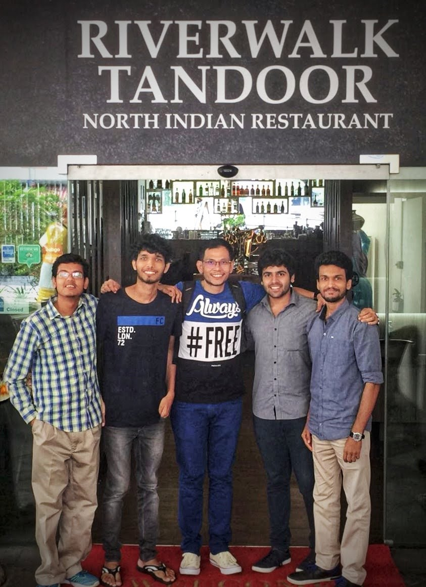
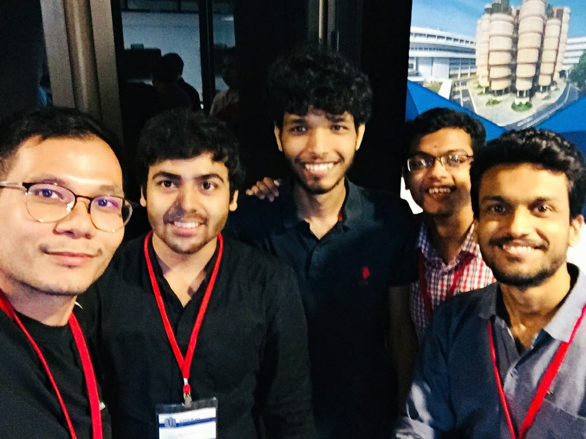

Having worked on 3 ML projects in my fourth year, I really wanted to take up the
challenge of collaborating within a distinguished research group, preferably abroad.
A foreign training or FT, as per my university lingo, was considered a prestigious
opportunity, as not only would you gain indispensable experience working in an established
institute set in an unfamiliar environment, it would also be really thrilling to
interact with people from different cultural backgrounds with similar interests
to freely exchange ideas and experiences.

Out of around 30 research labs that I applied to all over the world, I received
3 offers. I was most excited to work at the
[Rapid-Rich Object Search (ROSE) Lab](https://www.ntu.edu.sg/rose) at the
[Nanyang Technological University, Singapore](https://www.ntu.edu.sg/index),
as not only did the lab's research focus align with my interests, I would also be
able to gain work experience in [one of the top universities in Asia](https://www.topuniversities.com/university-rankings/asian-university-rankings/2018).

```
Contents

- How I got selected
  - Resume
  - Application Process
  - Interview Call

- The Project
  - Objectives
  - Motivation
  - Implementation
  - Result

- My Experience
```


## How I got selected

### Resume

In my fourth year, I started to diverge my career away from aerospace engineering,
to focus on my minor in Computer Science, especially in the areas of
Machine Learning and Artificial Intelligence. As semester projects, I was able
to work on some interesting applications of Machine Learning:

- [Mental Workload Estimation](https://github.com/kj7kunal/ML_Project):
As part of the Machine Learning course (CS60050), I trained various ML models to
estimate mental workload of a subject playing the N-Back game while wearing an
Emotiv BCI headset. The project included feature engineering using signal processing
techniques and resulted in a comparitive study between various ML models such
as Decision Trees, Random Forests and Neural Nets.
- [Artistic Image Rendering](https://github.com/kj7kunal/Artistic_Image_Rendering):
As part of the Deep Learning course (CS60048), I decided to implement neural
image style transfer as described in the paper
[_A Neural Algorithm of Artistic Style by Gatys et al_](https://arxiv.org/pdf/1508.06576v2.pdf).
This gave me a good understanding of how CNNs propagate signals, and how we can
use intermediate feature maps to extract representations of textures and color
schemes from the lower layers, and of structure from the deeper layers. I also
learned about designing custom loss functions for the given optimization problem.

Apart from curriculum coursework, I also independently took up online courses on 
Coursera such as the [Machine Learning course (Stanford University)](https://www.coursera.org/learn/machine-learning)
and the [Deep Learning Specialization (DeepLearning.AI)](https://www.coursera.org/specializations/deep-learning)
taught by Prof. Andrew Ng, to improve my knowledge of basic ML/DL techniques
through theory and coding assignments.

### Application Process

The application process was pretty straightforward. Since I was mainly focussed on
getting research experience, I had compiled a list of around 30-40 research labs
that I wanted to work with and emailed their respective POCs. 
However, most of the replies were negative, partly because I applied very late
in the year and partly because my background in aerospace engineering put me at
a disadvantage in a cohort of CS major students, which I feel was the case in my
applications to research internship programs like DAAD and MITACS.

Ultimately, I heard back from 3 places, one of which was ROSE Lab, a joint collaboration
between Nanyang Technological University, Singapore, and Peking University, China.
I was very surprised to have received a positive reply from them, as it was in the
top 10 of my list, which was basically an ambitious tier for me.

After exchanging a few emails, we scheduled an hour-long interview call a week later,
and I was asked to prepare a short presentation about 1~2 of my best projects.

### Interview Call

I sent my presentation 2 days in advance of the interview call. On the Skype call, I
connected with the Deputy Director, [Dr Dennis Sng](https://sg.linkedin.com/in/dennissng),
who oversaw projects undertaken by the ROSE Lab, [Dr Lin Shan](https://warwick.ac.uk/fac/sci/dcs/people/xuuldl/),
a research fellow, who led the project I was supposed to work on, and of course
the lab's POC, with whom I was so far in touch with.

The interview call went on quite smoothly, and was structured mainly around my
presentation. I was able to explain my contributions to my projects and answered
related questions to the best of my knowledge. I was also questioned about my major,
and why I was interested in Machine Learning, which I was also prepared to answer.

I got the acceptance mail a week after the interview call, and I was super excited
to start the visa process!

```
```

## The Project

### Objectives

The goal of the project was to simulate active space debris removal using tether-net
connected to satellites in formation. There were 3 main concepts involved:

- Spacecraft formation flying. This topic is well explored and enough literature was
available. It involved relative position control combined with orbital mechanics.

- Tether net modelling. The behaviour of the net had to be described as a spatially
distributed mechanical system.

- Contact dynamics. The collective behaviour of the net and the satellites in formation
during and after debris contact phases.

### Motivation

Among many things, space is also the most dangerous junkyard Earth has created.
If you have seen the 2013 film Gravity, the accident that caused the astronauts
to break off from the ship was due to the debris in space.


It is estimated that there are 600,000 debris fragments ranging from 1~10 cm,
and on average one satellite is destroyed by collision with space junk each year.
If satellites are not disposed of properly, the parts could become high-speed bullets
leading to a chain reaction of collisions, a theoretical scenario popularly known
as the [Kessler Syndrome](https://en.wikipedia.org/wiki/Kessler_syndrome).
Apart from dramatic accidents, such a scenario could lead to serious consequences
including unusable orbits or communication blackouts.

A number of cleanup efforts have been explored/proposed in recent years - robotic
grappling arms, harpoons, deploying nets, electrodynamic tethers, ground-based lasers, etc.

This project combined swarm satellites and tether-nets for Active Space Debris Removal.

### Implementation

Simulations for the various components were developed in MATLAB and working code was
replicated in C++ for faster experimentation. A C++ library implementation for MATLAB’s
matrix/vector manipulation was developed which reduced simulation time by 5 times
and allowed easy code porting.

#### Spacecraft formation flying


Relative orbit dynamics of two objects in close orbits, can be modelled using the
[Hill-Clohessy-Wiltshire (HCW) equations](https://en.wikipedia.org/wiki/Clohessy%E2%80%93Wiltshire_equations). These were used to model feedback linearization
based proportional-derivative (PD) controller for generating the control commands for the spacecraft, necessary to keep the spacecraft in formation to maintain the required
tether-net shape in various phases of the operation.

Continuous torque commands had to be converted to on-off commands to model actuators.
This was done using Pulse Width and Pulse Frequency modulation (PWPFM).

#### Tether net modelling


A [lumped parameter approach](https://en.wikipedia.org/wiki/Lumped-element_model#Mechanical_systems) is used to model the dynamics of the
tether-net and the tether-net to spacecraft connectivity.

This simplifies the description of the behaviour of spatially distributed
physical systems such as a tether-net, into a topology consisting of discrete
entities (nodes) that represent rigid bodies with mass and interactions between
rigid bodies as kinematic pairs (joints, springs and dampers).

### Result

The results of this research were drafted into a research paper and accepted for
[Interactive Presentation in the 69th International Astronautical Congress 2018](https://iafastro.directory/iac/archive/browse/IAC-18/A6/IP/48269/)
in Bremen, Germany. However, due to lack of sponsorship and funds, I was not able
to attend the conference.

```
```

## My Experience

As an aerospace engineering student, I was very enthusiastic about working at the
ISRO Satellite Centre, and I was very excited to fly to Bangalore as soon as my
summer vacation started.

Since I was an "unofficial" intern, I was not given any stipend, and I had to cut
my costs by staying at my uncle's place - about an hour of bus travel each day.
But also because of that, I had the benefits of working flexibly in terms of
hours and place of work.

My first week at ISAC, my mentor introduced my to the team at the Control
Dynamics and Simulation Group, who were mostly graduates from IIST. They were
really friendly, and talking to them was like talking to any senior from college.
There were 3 more interns from different universities, who had their own
stories of how they got their internships.

I usually started work at 10AM and ended work around 4PM. My mentor and I synced
up twice each week and discussed work updates every day. It motivated me to stay
on track. Since I could be flexible, I sometimes used to work from cafes near my
place instead of going to office. My mentor was super approachable, and I could
call him up in the middle of the night to discuss a sudden idea I had. I also
synced up with the group's project director, [Dr Vinod Kumar](https://www.siliconindia.com/profiles/dr-vinod-kumar-XEac3AFM.html), a few times, who told me about his long
journey at ISRO.

I enjoyed such 1on1 sessions. They helped me connect with the team better. I also
loved the two _chai breaks_, where employees used to line up for free tea/coffee
and free talk. In some of these, my mentor and the other team members used to
take us for tours of the Satellite Centre. It was unbelievable seeing the mission
control for the recently launched [GSAT-9](https://en.wikipedia.org/wiki/South_Asia_Satellite)
and [GSAT-11](https://en.wikipedia.org/wiki/GSAT-11) in development, right in front of our eyes!

However, amongst all things shiny, there were things that stood out
that I could not help feeling irritated about. Offices were similar to old Indian
government offices desperately in need of an upgrade. Some of the PCs we used to
work on were still equipped with age-old hardware like CRT monitors. My team's
office was a room divided into cubicles, which my mentor said made him feel
claustrophobic at times. I used to see more progress when I was working on my
laptop from a cafe than when I was working in a no-window office all day.

I learned a lot talking to my colleagues. The engineers/scientists shared a lot
of career insight, which had helped me gear up into changing my career in the
coming months. I discussed about some ML projects I worked on in college, and 
I learned how it was applied in projects at ISRO. Discussions that could not be
completed over _chai breaks_ were continued the next day or free pizza treats
after work!



