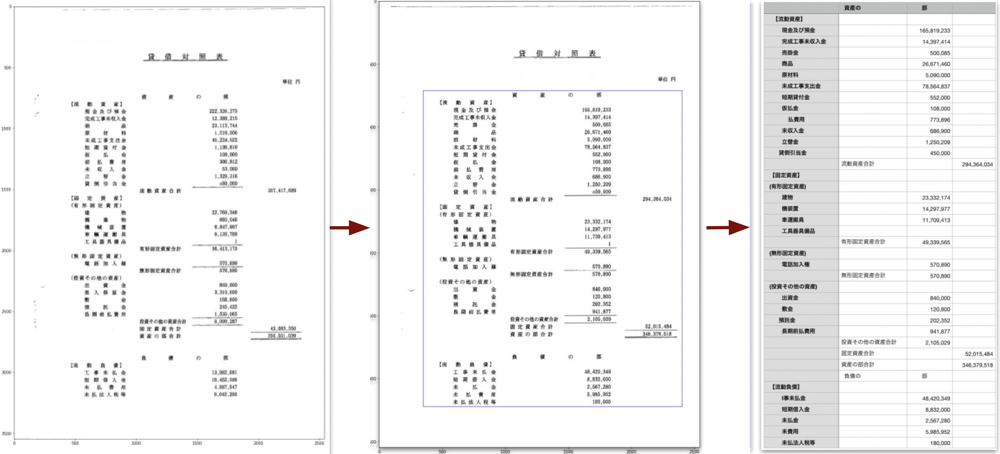
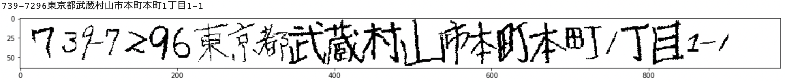
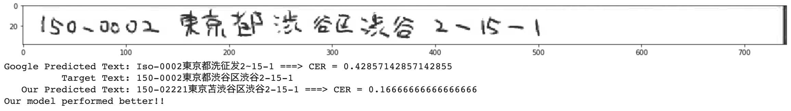
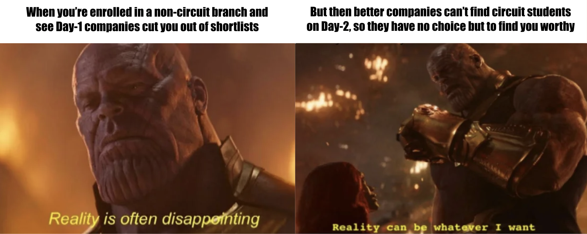

I have been working with [Visional Inc.](https://www.visional.inc/ja/index.html), based in
Tokyo, Japan, since October 2019. This was my first job after graduation, and I have been
working as an ML/AI Engineer in the AI Team. As it is my **second work anniversary**, I
think it would be worthwhile to look back and reflect on my journey so far.

My work mainly involves the development of end-to-end Machine Learning workflows as well as
their deployment in the various services and products offered by the company.

I also contribute to Machine Learning research undertaken by the AI team, and had initiated
and led the research and development of an OCR system for Japanese handwritten addresses.

I have limited work proficiency in Japanese, so I prefer to use English as much as possible.
I am able to use English for work within the AI team, but often need to switch to Japanese
for cross-team communication. 

```
```
## Contents

- <a href="#company">About Visional</a>
- <a href="#projects">My Projects</a>
  - <a href="#p1">Financial Document OCR System</a>
  - <a href="#p2">Research: Japanese handwritten OCR</a>
  - <a href="#p3">Employee Slack Analytics</a>
  - <a href="#p4">HeadHunter Recommendation</a>
  - <a href="#p5">Security Bug Report Classification</a>
- <a href="#experience">My Experience</a>
- <a href="#selected">How I got selected</a>
  - <a href="#preparation">Interview Preparation</a>
  - <a href="#placements">Placement Interviews</a>

```
```

<h2 id="company">About Visional</h2>

<p align="center">
  
</p>

Established in April 2009, BizReach has been operating a variety of Internet services
that support the future of work in Japan with a mission that roughly translates into
"creating a society where everyone can believe in their own potential". The company,
headquartered in (Shibuya) Tokyo, has regional offices in Osaka, Nagoya, Fukuoka, Shizuoka,
and Hiroshima.

Visional was born in February 2020, when Bizreach Inc. shifted to a group management
structure. The company's main focus is primarily in the HR Tech and SaaS business that promote
digital transformation (DX) of industry and support the improvement of productivity in Japan.
The group broadly has a heirarchical structure with the following products and services:

- [Visional Corporation](https://www.visional.inc/ja/index.html), the holding company,
supports the group management
- [Bizreach Corporation](https://www.bizreach.co.jp/), responsible for the management of
the original HR Tech and SaaS businesses
  - [Bizreach](https://www.bizreach.jp/), a job-change website that connects companies with
  human resources with immediate availability
  - [CareerTrek](https://www.careertrek.com/), a job search site for young graduates
  - [HRMOS](https://hrmos.co/), a human resources management cloud platform
  - [Campus](https://br-campus.jp/), an alumni network service for career consultation
- [Visional Incubation Corporation](https://www.visional.inc/ja/visional-incubation.html),
responsible for new business development and acquisitions
  - [Succeed](https://br-succeed.jp/), an M&A platform for business succession
  - [Yamory](https://yamory.io/), security vulnerability management cloud for IT systems
  - [BizHint](https://bizhint.jp/), a website providing "business tips" in the form of
  keywords, case studies and solutions
  - [BINAR](https://binar.jp/), a career change platform for highly specialized IT Engineers
  - [StanBy](https://jp.stanby.com/), a job-search engine jointly owned with Yahoo Japan

Each of the products have their own specific engineering teams that follow custom Agile
software development life cycles (SDLCs) they are comfortable with. 

The **AI Team** is a team of around 20 ML/AI engineers that collaborate with one or more of the
above mentioned teams to understand their business requirements, and leverage data to deploy
AI features in production environments to drive business solutions.

```
```

<h2 id="projects">My Projects</h2>

As an engineer in the AI team, I have to actively communicate requirements and decisions on
various ML pipelines with multiple service teams simultaneously. I usually have 1-2 
service-related projects and an independent research project in a single half-year term.

From my experience, I believe that the engineers working in the AI Team at Visional switch
frequently between the roles and responsibilities of a **Data Scientist**, an **ML Engineer**,
as well as a **Research Scientist** for different projects undertaken at a time.

An average ML project includes the following:

- understanding the requirements of the service teams
- analyzing data to optimize and improve services
- developing custom data models, algorithms and full-stack systems
- collaborating with service teams to deploy the AI features in production
- considering evaluation metrics/systems to quantify/monitor outcomes

The projects require a good understanding of ML techniques, algorithms and statistics. Most
of the work also involves Natural Language Processing techniques. I have also been able to
apply my Computer Vision skills to a few projects.

Following are few of the projects I have worked on so far.

<h3 id="p1">Financial Document OCR System</h3>

[BizReach Succeed](https://br-succeed.jp/service) provides an M&A platform to match companies
looking for succession with potential buyers. As part of their services, they have to analyze
financial documents, which are most often personally handed over as hard-copies by the clients.
These documents are then scanned and the data is manually entered into spreadsheets for
financial analysis typically resulting in business valuations.

Since Succeed is a relatively small team, the manual data-entry efforts can take upto
**100hrs/month**. Data-entry basically involves entering tabular data into spreadsheet. This
tabular data is mostly present within PDF scans. Current OCR systems are well equipped to
detect text in an image, however, they fail to preserve spatial information such as table cells. 

I developed an **OCR system** capable of **preserving tabular structure** within the image.
The system was built using [OpenCV](https://pypi.org/project/opencv-python/) and
[Google Vision API](https://cloud.google.com/vision/docs/ocr) in **Python**, and deployed
using **Docker**, **Terraform** and **AWS**. Some text post-processing was implemented using
a dictionary of Japanese financial terms.

The pipeline roughly consists of the following steps:
- Parsing OCR request from AWS SQS and AWS S3
- Getting page images from PDF and fixing text orientation
- Table detection and extraction from page image
- OCR Text Detection request to Google Vision API
- Alignment of Google Vision API annotations
- Proofreading result text using a dictionary
- Save output XLS workbook to AWS S3

<p align="center">
  
</p>

<h3 id="p2">Research: Japanese handwritten OCR</h3>

In many ways, hand-filled forms are still a part of Japan's official processes. For instance,
our company requires candidates to fill out their details for registration. Since it is
imperative that we make no mistakes while entering the details into our systems, this information
is then manually filled by the operator. However, to me, it looked like an opportunity to explore and further research on Japanese
handwritten OCR systems for the AI team. 

The research focusses on the address field in the BizReach registration forms, and aims to
harness the structure present in addresses to explore domain augmentation methods. A 
[list of Japanese addresses](http://jusyo.jp/index.html) distributed by Japan Post was used
to synthetically generate the train dataset. The textual addresses were transformed into
address images using character images available in the [ETL](http://etlcdb.db.aist.go.jp/)
and [EMNIST](https://www.nist.gov/itl/products-and-services/emnist-dataset) datasets.
Data augmentation was introduced to account for variances in handwriting:

- shape of characters
- spacing between characters (narrow or wide)
- rotation of characters (straight or slant)
- size of characters (big or small)
- stroke strength of characters (thick or thin)

<p align="center">
  
</p>

The [**Convolutional Recurrent Neural Network** (CRNN)](https://arxiv.org/abs/1507.05717)
architecture was chosen. The end-to-end model, that combines CNN (image feature extraction),
RNN (sequence recogntion) and CTC loss, was implemented in **PyTorch**.

The lexicon-free model was able to achieve a **44% lower CER (character error rate) than the
[Google Vision API](https://cloud.google.com/vision/docs/handwriting)** on a test set of actual
handwritten Japanese addresses. Currently, I am trying to improve the CER further using
lexicon-based algorithms, and simultaneously documenting the methodology and results aimed at a
future publication.

<p align="center">
  
</p>


<h3 id="p3">Employee Slack Analytics</h3>

The [HRMOS](https://hrmos.co/) team develops a variety of HR-Tech services, such as employee
databases, attendance logging and performance tracking systems. Their focus is the improvement
of productivity within client business teams. 

Each company has data on their employees which can be leveraged using AI to measure, in an
abstract sense, the productivity of the employees. This data is usually available within the
employee database of the company and has a well-defined structure to it. In recent years,
Slack, Workplace, Teams, etc have gained preference over emails, especially in the tech
industry. 

**Public conversations** can be viewed as unconventional sources of data, which can
be processed using NLP techniques to quantify productivity. For instance, messages and
replies can be considered entities that signal a connection link between two employees.
Frequency of interactions on public channels can signal the degree of involvement of a
certain employee in a certain topic.

I built a simple GUI in **Vue.js** and **Python**, and deployed it using **Docker** for
internal HR to visualize activity and messaging trends on the Visional Slack workspace.
**Japanese text processing** using [MeCab](https://taku910.github.io/mecab/) tagger and
[NEologd](https://github.com/neologd/mecab-ipadic-neologd#overview) dictionary were used
to clean the unstructured conversational data. The following are some of the features have
been implemented in the GUI:

- Conversation topic transitions, to visualize the change over time in underlying topics
of conversation, discovered using **LDA topic modeling**
- Interactive User/Channel wordclouds, to visualize a summarized history of conversation
keywords
- Matching similar users, based on high topic probabilities in conversations

<h3 id="p4">HeadHunter Recommendation</h3>

[BizReach](https://www.bizreach.jp/), Visional's primary service, is a job-change website that
connects individuals with recruiters and companies through job listings. Other than job search
results, the website's homepage also recommends job listings to the candidates on the basis of
their preferences, past activity and searches. From point of view of the recruiters, BizReach
aims to recommend candidates that are most likely to be scouted by them. 

The HeadHunter recommendation feature was proposed by the AI team, with the aim to increase
scouting rate for headhunters. The feature was developed to assist existing recommendation
systems by using **implicit feedback** datasets like candidate-job access log data for newly
registered candidates, for whom there is insufficient scout data. The same data could be
used to recommend candidates to recruiters who had posted the jobs.

I was involved in the assessment of the effectiveness of using access log data for the problem
and comparing the performance of various recommendation models in offline testing. 
A 25% hit rate was obtained using [Implicit](https://implicit.readthedocs.io/en/latest/quickstart.html)'s
[Alternating Least Squares](https://implicit.readthedocs.io/en/latest/als.html) **collaborative
filtering** model for demonstration of the proposed project.

<h3 id="p5">Security Bug Report Classification</h3>

Publicly disclosed cybersecurity vulnerabilities are assigned a 
[Common Vulnerabilities and Exposures (CVE)](https://www.cve.org/About/Overview) ID, and
the [National Vulnerability Database](https://nvd.nist.gov/) performs analysis on CVEs by
aggregating data points from the description, references supplied and any supplemental
data that can be found publicly at that time.

[Yamory](https://yamory.io/) develops a security vulnerability management cloud for IT systems.
The vulnerability database used by yamory consists of information analyzed and evaluated manually
by a dedicated security analyst. To build this database, analysts have to scour multiple sources
like tweets, bug report websites, security articles, etc. 

We developed a system to scrape data from such sources and classify them as security vulnerability
reports. Tweets mentioning a CVE ID were scraped and stored and analyzed using **Elasticsearch**
whereas **Scrapy** was used to scrape bug reports from active bug reporting websites. 
**Named Entity Recognition** was used to identify software names within the descriptions.
A 0.81 F-score was achieved in classifying bug reports using a **bigram language model**
trained over NVD/CVE Descriptions as ground truth. 

```
```

<h2 id="experience">My Experience</h2>


```
```

<h2 id="selected">How I got selected</h2>

<h3 id="preparation">Interview Preparation</h3>

After [my internship with ROSE Lab](/blog/ntu-intern) in the summer of 2018,
I immediately started to prepare for job interviews in the 
[IIT Kharagpur Placement Season 2018](https://www.shiksha.com/b-tech/articles/iit-kharagpur-placements-blogId-20045#:~:text=placements%202018%20below.-,IIT%20Kharagpur%20placements,-are%20conducted%20for).
Placements are a time of extensive planning and preparation, and depending on their
targeted companies, students choose from various preparation strategies to get through. 

Fresh from a very interesting internship, I was determined to pursue a Machine Learning 
/ Software Engineering role, even though my major in Aerospace Engineering put me at a
fair disadvantage compared to students of "circuit" (CS, EE, MA, etc) branches. In a batch
of over 1000 applicants, companies had to apply such constraints in order to make the
shortlist really "short". This meant, that I would not be able to sit for the tests for
these companies, even though I was fairly confident in my skills. On top of this, the rules
restricted us from accepting more than one job offer in the entire season.

Keeping in mind the above constraints, I decided to keep my preparation very general and
open to multiple opportunities. From information gathered from seniors as well as
company introductory talks, I understood that most of the tests involved similar formats.
On the basis of this information, my preparation included brushing up on:

- Analytical/Probability skills: [Fifty Challenging Problems in Probability with Solutions](https://mbapreponline.files.wordpress.com/2013/07/fifty_challenging_problems_in__2.pdf)
- Machine Learning theory: my notes from online courses on Coursera such as the
[Machine Learning course (Stanford University)](https://www.coursera.org/learn/machine-learning)
and the [Deep Learning Specialization (DeepLearning.AI)](https://www.coursera.org/specializations/deep-learning)
- Data Structures/Algorithms: Practice questions on [InterviewBit](https://www.interviewbit.com/)

This way, I was able to prepare fairly well for both software and data science roles. 

Parallely, I drafted a one-page resume showcasing my projects and my internships, and got
it reviewed by a lot of friends and seniors. After a few revisions, I submitted it to the
placement portal, and waited anxiously for the placement process to start.

<h3 id="placements">Placement Interviews</h3>

Reality hit hard on Day 1, when I found out some companies I was hoping to be shortlisted
in had actually used the "circuit branch" constraint, and I was only able to sit in 2 of
the 6 companies I applied for that day. My first interview went well, but I eventually
apologized and pulled out, since their Embedded Software Engineer role was not
something I was very keen about. I was not able to perform well my second interview, for an
analyst position, since I had not prepared for the "Case Interview" style at all. In summary,
Day 1 was a complete bust because of the restrictions on the placement process, and I was
disappointed with the limited options I had.

Later that night, however, I was happy to find out that I cleared the shortlist for
BizReach Inc., based in Tokyo, for the Machine Learning Engineer role. Day 2 is usually
the arena for companies that are new participants in the placements, and sometimes these
opportunities are on-par or even better than the previous day. BizReach was one such
company, and the job description was exactly what I had hoped for!

I called up a senior who was working in Mercari, Tokyo (I had also called him up the
previous night, since I was furious Mercari was only looking for circuit branch students),
and asked him some tips for interviewing with Japanese people. His input really helped
me refocus my mind on this new opportunity. After some modest revision and self pep-talk,
I called it a night.

<p align="center">
  
</p>

The next day, when I showed up for the interviews, and I was surprised to see only a few
candidates lined up. I had a quick judgmental glance at the candidates, and narcissitically
reassured myself. I knew I was a slight bit overconfident, but in such a situation, it
really helped me to not ponder on my nerves. I ran simulations of my plan in my head while
I waited.

I was already impressed at how punctual the Japanese were at taking interviews. Each
interview went on for a total maximum of 30-minutes, with two exact 15-minute segments.
The first part was basically a 3-on-1 technical interview, involving a CV runthrough
and some behavioral questions, whereas the second part was a coding round.

My interview began at 1830hrs, and I went inside and greeted them, saying "Konnichiwa" 
(hello, in Japanese). They were delighted, and started talking in Japanese to test/tease me.
I told them liked watching anime with subtitles, and I liked to pick up a few words here
and there. I was happy with how the mood was from that point - light and cheery. They
introduced themselves as Takeuchi-san (CTO), Ikawa-san (VP of Engineering) and Dat-san
(my future team lead). 

In the first part, I was mainly asked in detail about my thesis project, with some questions
about the image segmentation pipeline, and also my ROSE Lab internship. Other than 
well-prepared answers to possible questions to my resume, I was quick to emphasize on my
experience working in an Asian working environment as well as my knowledge about Japan
during the behavioral questions. In general, I felt our interaction was positive and I was
optimistic when I began the coding part. There were two questions of easy/medium difficulty,
involving array manipulation and 2-pointers. I was easily able to work through them and
write clean code in Python, which was the programming language I was most comfortable with
as well as the language with which I was expected to work with if I were selected.

I left at exactly 1900hrs after asking a few more questions I had about the company and the
role, and was told to wait outside for about an hour. At 2000hrs, all 3 interviewers came
outside, and announced the three names they selected - and I was so relieved when I heard mine!
The interviewers left promptly after taking some pictures with us outside the venue. I called
up my parents and my friends and shared the news. It was one of the happiest nights of my
life, and I did no injustice to celebrating that feeling! It was the result of hard work
and meticulous planning, and most of all - being my genuine self.

