

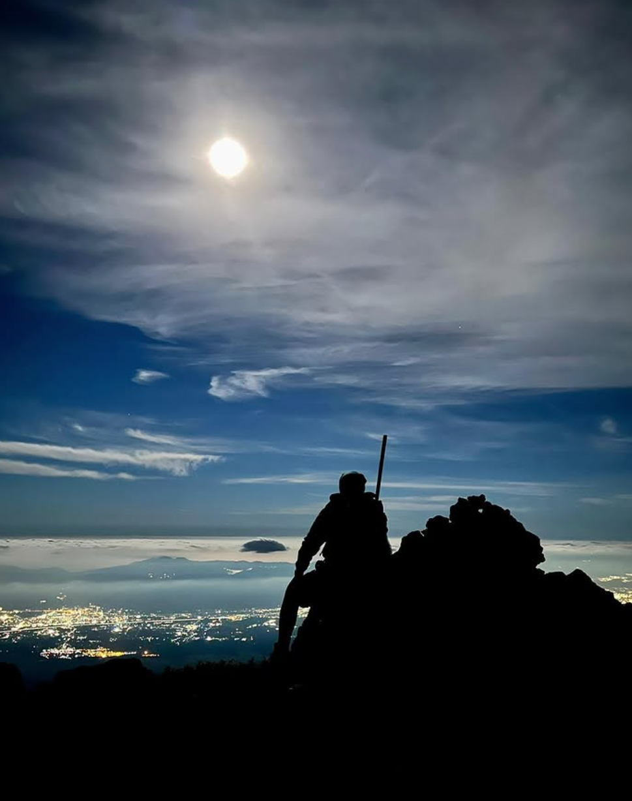

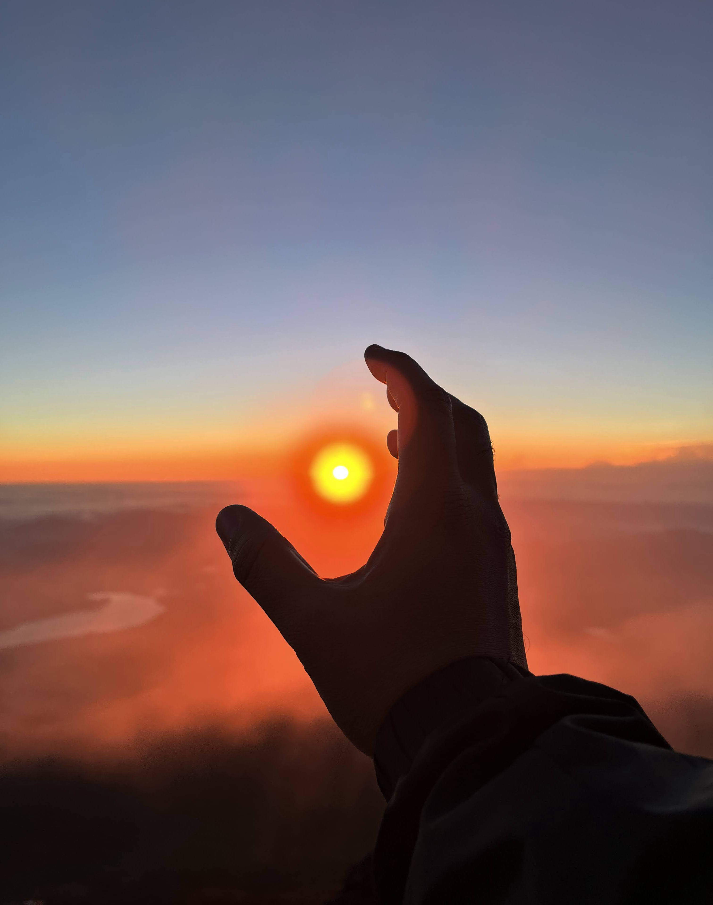

## Overview
- Trail: Subashiri (start ~1950m 5th Station) late-season (last open day)
- Style: "Bullet" climb (overnight up & down without hut stay) – 2025 update: no longer permitted
- Start: ~17:00 / Summit: ~03:45 / Sunrise (Goraikō): 05:24 / Total moving time: ~10h ascent + long sandy descent
- Weather: Clear, full moon, cold & windy at summit pre-dawn
- Highlight: Green flash at sunrise and glory phenomenon at summit

## Preparation

### Planning

I wanted to keep this a pure personal challenge, but still reduce avoidable risk.

**Research**
- Selected the [Subashiri Trail](https://www.fujisan-climb.jp/en/trails/subashiri-trail.html)
  - lower crowds, for avoiding congestion and be at my pace
  - forest approach, for mentally easing into altitude
  - merges into Yoshida Trail above 8th station, the final part
- Checked final operational day of season & bus timetables
  - Shinjuku ↔ Gotemba
  - Gotemba ↔ Subashiri 5th Station
- Studied altitude profile
  - bus from Gotemba to Subashiri 5th Station covers ~1950m 
  - Leaves a ~1776m vertical climb to summit (3776m)
- Target pace
  - relaxed through forest before dusk
  - conservative pacing above tree line to manage heart rate & acclimatization

**Fitness & Acclimatization**
- Developed fitness by regular incline running on treadmill
- Planned acclimatization by conservative pacing, timed stops at stations, budgeting hydration & calories.

**Weather & Safety**
- Monitored [mountain-forecast.com](https://www.mountain-forecast.com/peaks/Fuji-san/forecasts/3776) for thunderstorms
- Discussed hike plan with a friend in Tokyo

### Packing List
- Feet: Mid-weight hiking boots, merino socks + spare liner
- Layers: Tech tee (start), light fleece, synthetic puffy, shell (windproof), extra base layer for summit
- Head: Beanie, headlamp (fresh batteries)
- Hands: Thin liner gloves, insulated gloves (summit)
- Hydration: 2L water + 1L sports drink (consumed ~3L total)
- Nutrition: Energy bars, IN energy gels, onigiri, burritos (cooked myself), drip coffee kit (lol class!)
- Navigation & Misc: Paper timetable snapshot, phone (offline maps), first-aid (blister kit), power bank

Pack weight stayed manageable (~7–8kg) allowing steady cadence.

### Route & Timeline (approx)
| Time  | Altitude | Segment |
|-------|----------|---------|
| 17:00 | 1950m | Depart Subashiri 5th (forest, solo, fading light) |
| 18:30 | ~2300m | Dusk - headlamp on, silence sinks in |
| 20:30 | ~2700m | Tree line exit; pumice & ash switchbacks |
| 22:30 | ~3100m | Colder wind; stars brighten (Cassiopeia, Orion, Pleiades) |
| 00:30 | ~3300m | Longer rests for layering & breathing control |
| 02:15 | 3400m | Join Yoshida trail at 8th station; procession of headlamps |
| 03:45 | 3776m | Summit Torii & Kusushi shrine; moonlit crater peek |
| 05:20 | 3776m | Move to sunrise viewpoint |
| 05:24 | 3776m | Sunrise & brief green flash (Goraikō) |
| ~06:00 | 3770m | Summit coffee ritual |
| ~07:00 | 3500m | Begin long sandy descent (Subashiri zigzags) |
| Late AM | 1950m | Back to 5th station (robotic downhill, 120bpm playlist) |

## Night Ascent: Solitude & Moonlight

The tallest mountain in Japan adds the most quintessentially Japanese (wabi-sabi?) presence to Tokyo's skyline. 
On a clear evening, it is a comforting sight to see the sun go down between the mountain and _The Tree_. 

As I acquainted with its formidable stature from close up, my intention to climb solo immediately gave me a _fight-or-flight_ rush.

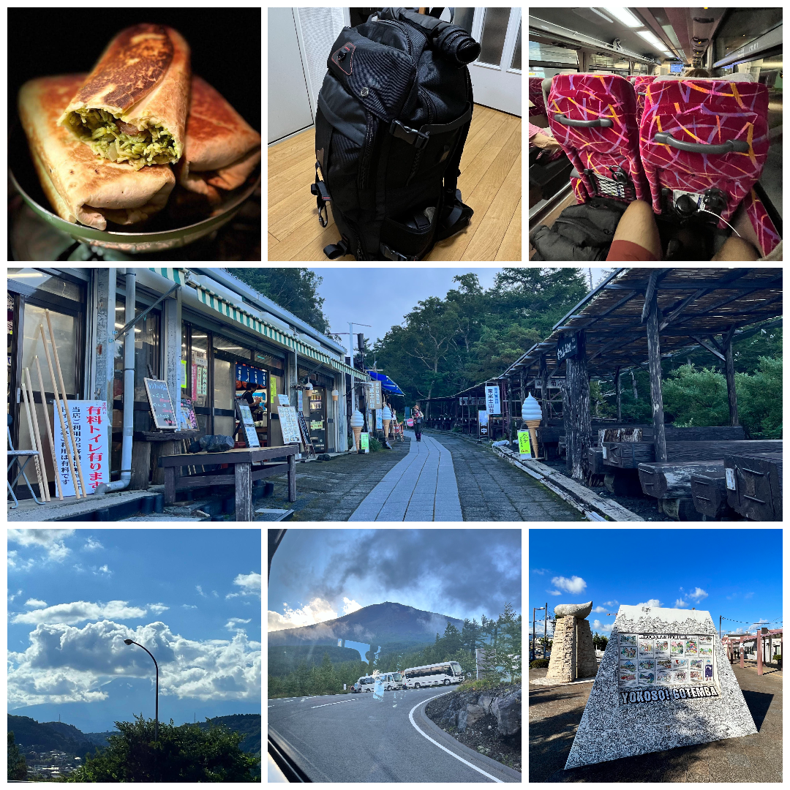

*Approach logistics dialed: buses & pacing plan set before stepping onto the trail.*

It was a relief to remember that I start at 2000m, at the 5th station, instead of the bottom. 
I had decided to take the Subashiri Trail, which is less crowded and goes through a forest. 

A third of the height already covered by bus, I started my ascent at 5pm for the continuous hike to the top (all the mountain huts were booked, and it was the last day before Fuji closed for the season).

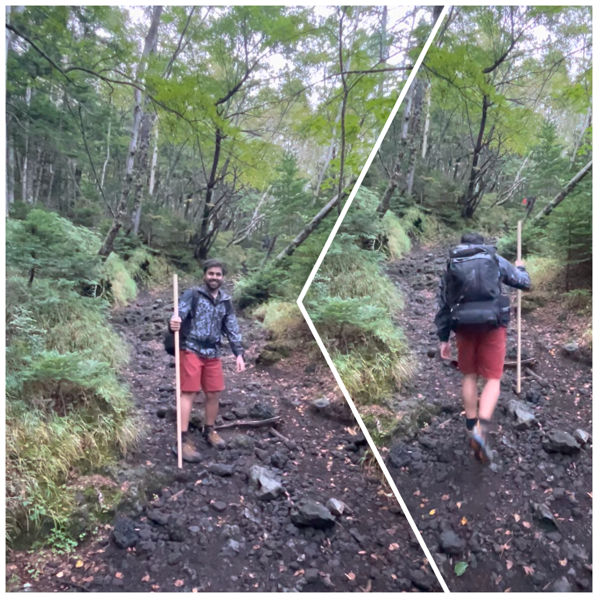

*Forest ahead of Subashiri 5th Station (~1950m). Quiet. Last day of the season energy.*

As the sun went down, I quickly realised that I was the only one within a 100 metre radius, as there were not a lot of climbers who chose his trail.
Climbing through the forest, I felt a pang of fear as the night fell and I took out my headlamp. 

The dead silence and long hike leaves you alone with your ideas and any unfamiliar setting gives birth to conjectural horrors.
Fortunately, this thriller had an interval. I met a group resting at the sixth station hut, and so I made my first burrito stop.

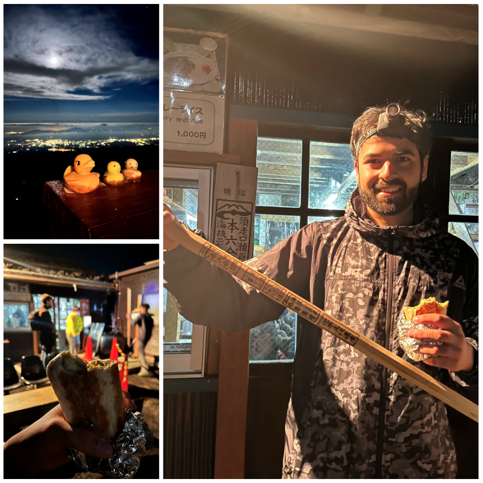

*Breaking out of the forest near the Sixth Station; 3 ducks and 3 people.*

As I pushed forth, I became more and more aware of how "dead" the silence actually was. 
There were no signs of life, not a single insect on the sterile slope of the volcano. 
As I got more and more comfortable with the trail, switched off my headlamp to let my eyes adjust to the full moon's light illuminating the path.

The terrain alternated between rocky pumice and sandy ash, and was thankful for my hiking shoes for giving me sure footing on both. 

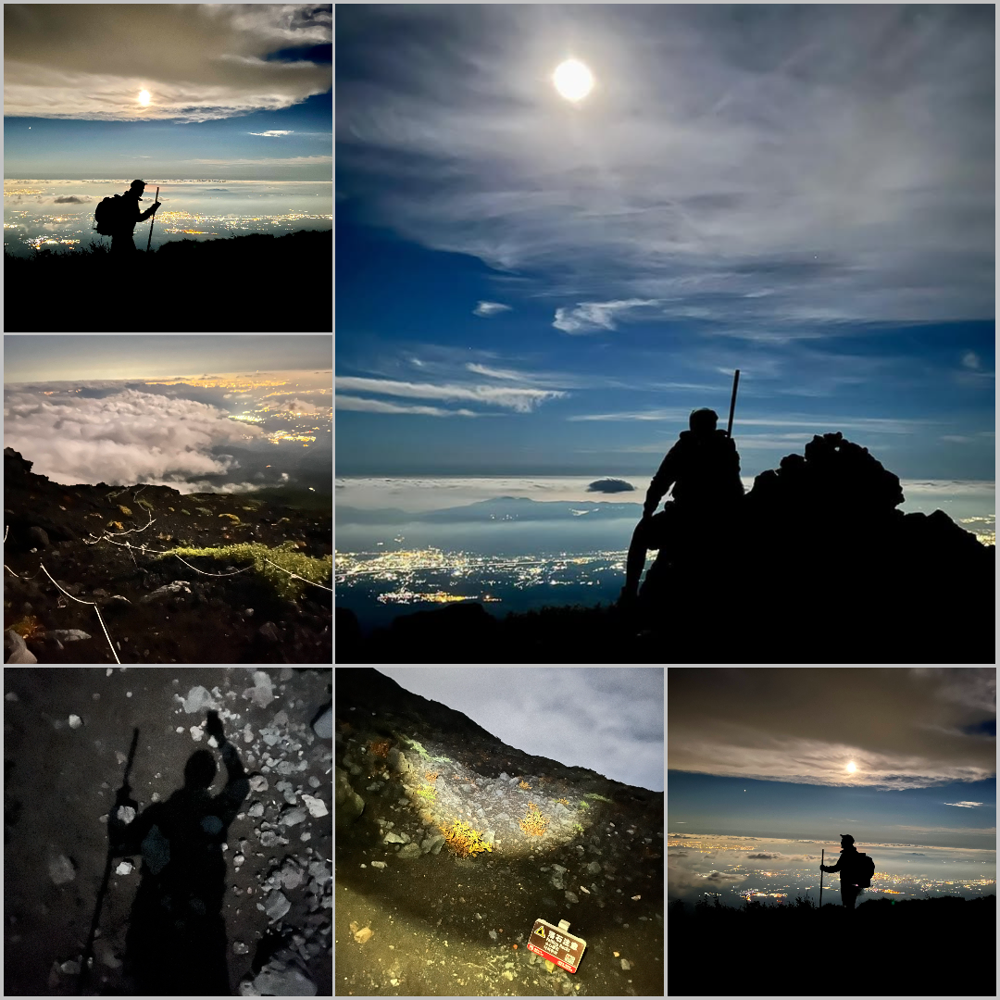

*Moonlit progress: alternating between steady pace and quiet rests.*

It was fairly clear, so while I rested my loudly beating heart, I was able to identify many constellations I had memorised as a nerdy child - Casseiopeia, Big Dipper, Ursa Minor, Orion, Pleiades. The city below glimmered, and the cloud cover below me seemed like a confluence of artificial and natural light. In this backdrop, I exercised some of my photography skills.

I had to make multiple stops along the way, not only to catch my breath, but to put on warmer layers, eat my energy bars and most importantly, to acclimatize to the altitude.

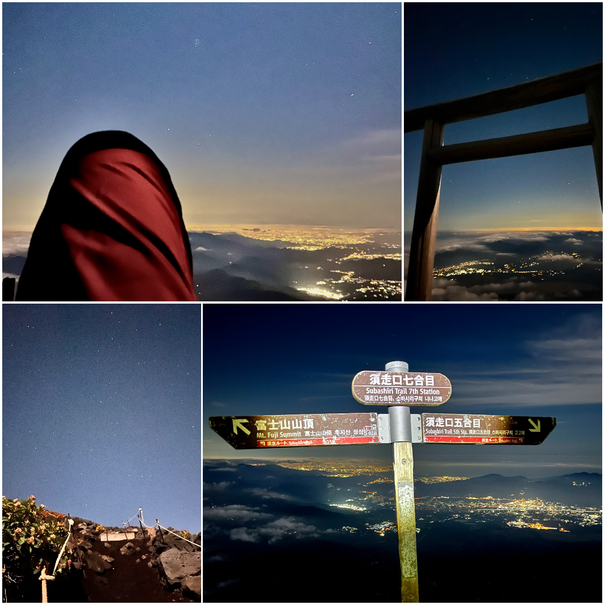

*Progress reassurance: station boards marking altitude and remaining grind.*

At the 8th station, at 3400m, the Yoshida and Subashiri trail met for the final part of the climb. Other than reckless bullet climbers like me, tour groups started emerging from their huts, joining the huge procession to the top. The moon hid behind the mountain while a single file of headlamps chattered excitedly/tiredly above and below me. "Lights will guide you home," I chuckled.

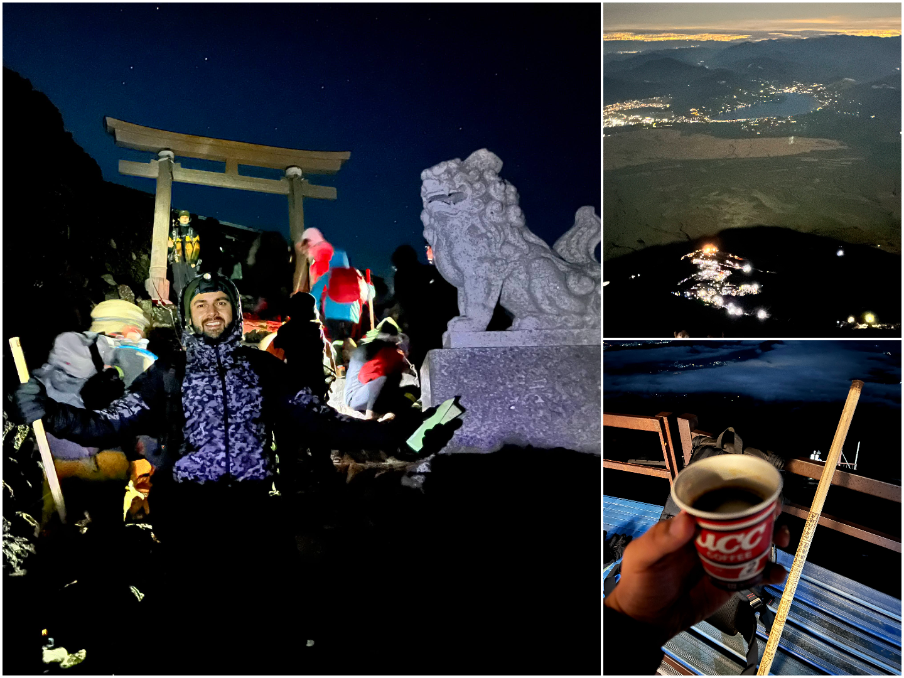

*Pre‑dawn push: thin cold air, long shuffle steps, headlamps stringing up the slope.*

And then, at 3:45am I saw the final Torii gate and 2 koma-inus of the Kusushi shrine marking the summit. The moon showed its familiar full face as climbed my way up the stone stairs to the flat ground of the summit. I let out a short "woooh!" as I blended with the tired but proud faces. 

After almost 10 hours of semi-continuous hard climbing, I had finally made it! And now it was time to wait for promised sunrise. The Goraiko.

## Summit & Sunrise
It was scheduled at 05:24am, so I had a lot of time till then. I roamed around aimlessly, had a scary peek down the bizarre volcanic crater in the moonlight. I found a nice little cradle in the rocks to sit in, shielded from the cold wind. 

The sky was orange for quite a long time, but I left my spot only around 05:20, when the rays of the rising sun crept from behind mountains in the horizon stretching far across the eastern sky.

The sunrise was beautiful. A small unexpected blob of bright green light climbed up over a distant mountain - [The Green Flash](https://en.wikipedia.org/wiki/Green_flash). It was unexpected and it was beautiful. I might have had goosebumps from the cold already, but I think a few more came up. As quickly as it had appeared, it vanished into the expected bright orange light of the sun. 

Someone nearby shouted _Ohaiyo Gozaimasu!_ and people chimed back in response. I couldn't stop smiling. It was very fulfilling.

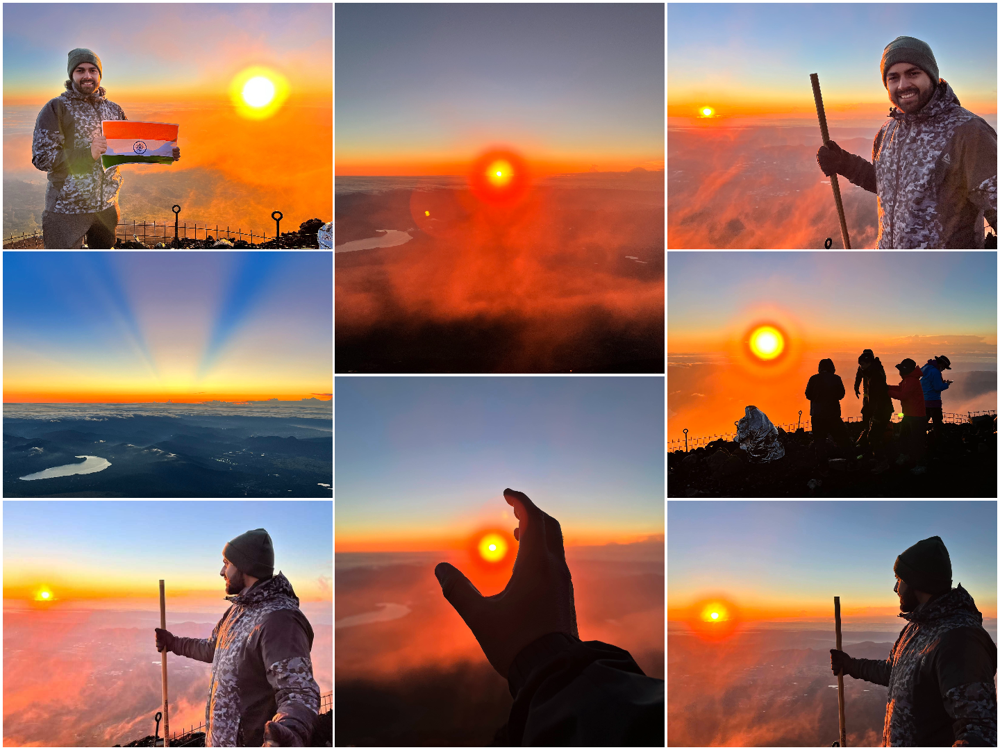

*The long dawn gradient giving way to the brief green flash and full sun emergence.*

## Descent

After warming up from the heat of the sun, my body found a new zeal to explore the summit - but by 06:00am my body was loudly craving coffee. 
On the way up, I had regretted lugging the coffee grinder up the mountain, but the moment I ground the beans, every extra gram felt justified. 

The pour-over was my small meditative ritual: careful swirl, patient drip, the black aroma slicing clean through the cold air. 
A few passersby paused, inhaled, and smiled - instant validation that coffee is a hobby that pays dividends. 
I sat on a rock with my third burrito, hot cup in hand, and let the summit unfold around me.

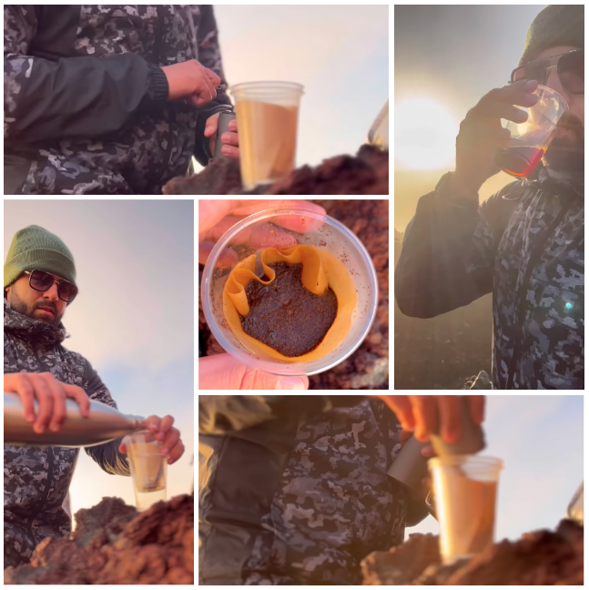

*Summit drip coffee: warmth, aroma, and mild flex to passing climbers.*

I edged closer to the crater and peered down - raw and ghastly in the morning light. Then a bank of cloud slid in and softened everything. 

At this point I noticed [_Glory_](https://en.wikipedia.org/wiki/Glory_(optical_phenomenon)) - a halo with my own shadow standing at its centre. 
I’d never seen it before and for a few stunned seconds it felt as though I was seeing things.

I took a handful of photos and finally gave myself one last long look at the horizon before I started the _very long, uninspiring_ descent. It was a continuous zigzag trail down one side of the mountain, and after a point, I robotically made my way down the loose and sandy slope with 120bpm music in my ears.

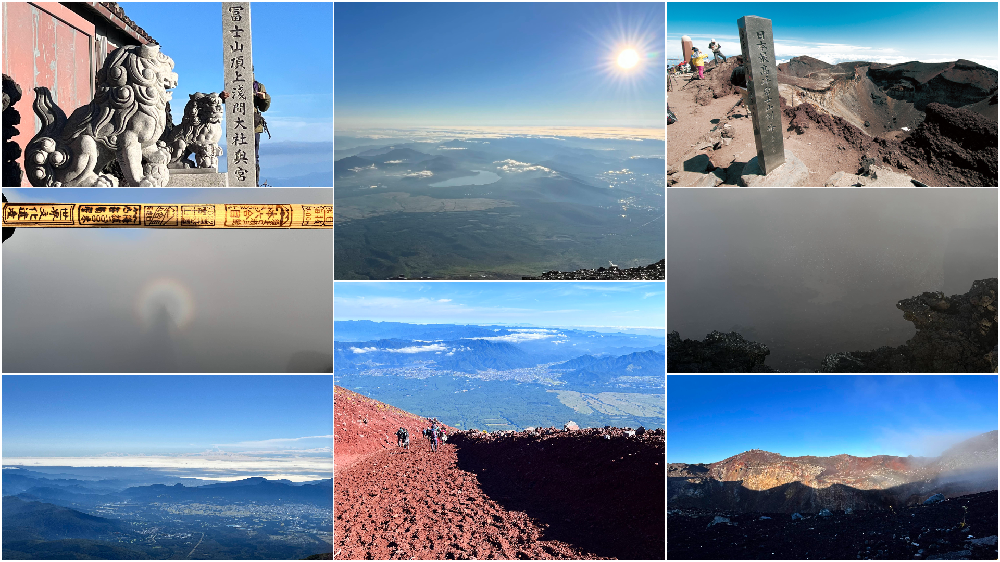

*Ash monotony: controlled slides, calf fatigue, counting switchbacks.*

I slept on my bus back. I slept on my train back. And I slept the entire day.

I am glad I was able to finally complete this milestone.

## Tips & Safety (Not Advice, Just What Worked For Me)
- Pace: Short steps, steady breathing cadence, micro photography pauses
- Layer discipline: Add early before shivering
- Night navigation: Trust reflective trail markers, follow the trail ropes
- Altitude: Sickness risk mitigated with sufficient hydration
- Nutrition: Small frequent protein and energy rich bites
- Descent: Heel plunge + controlled slide in deep ash + shoe gaiters for reduced debris-in-boot annoyance
- Bullet ethics: I set strict pace plans according to my fitness. Consider hut stay (official advice), if unsure

If you plan something similar: **respect the mountain**, **overprepare vs under**, and **treasure the quiet moments** between breaths.
